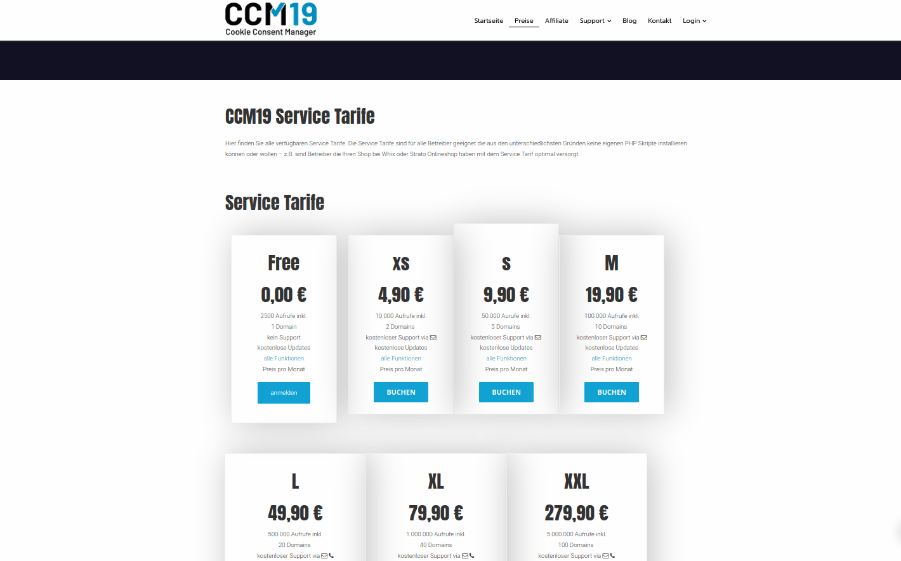

# Registrierung

Die Registrierung bei der Service-Variante ist denkbar einfach.

Sie wählen auf der Webseite im [Bereich "Service-Variante"](https://www.ccm19.de/ccm19-service-tarife.html) den für Sie passenden Tarif aus und registrieren sich mit Ihren Daten. Danach erhalten Sie per E-Mail die Daten für den Login ins System.

Sollten Sie bereits einen Account auf ccm19 haben, loggen Sie sich in den bestehenden Account ein und navigieren Sie wieder zu der Service-Varianten Übersicht. Dort können sie dann einfach den für Sie passenden Tarif buchen und er wird im System hinterlegt. Danach können Sie sich über den Punkt **Login > Service Variante Login** in Ihr System einloggen und es verwenden.