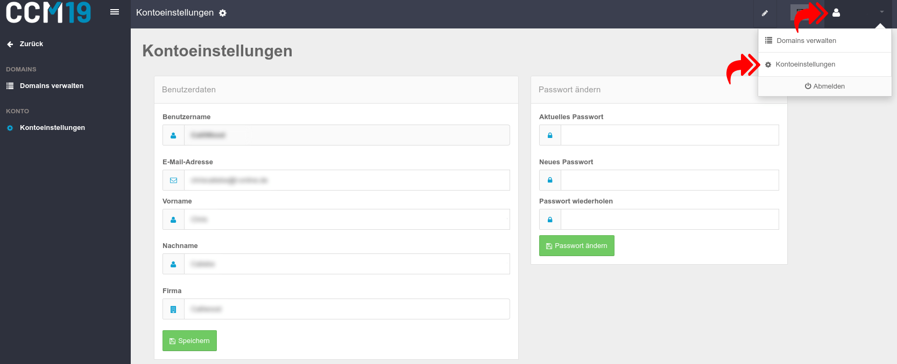

# Kontoeinstellungen

In den Kontoeinstellungen können Sie Ihre E-Mail Adresse, Vor-, Nach- und Firmen-Namen ändern sowie ein neues Passwort anlegen. Die Kontoeinstellungen finden Sie nach einem Klick oben rechts auf Ihren Usernamen und dann auf den Punkt "Kontoeinstellungen".

Wichtig sind vor allem Benutzername, E-Mail Adresse und Passwort - alle anderen Daten sind rein kosmetischer Natur.