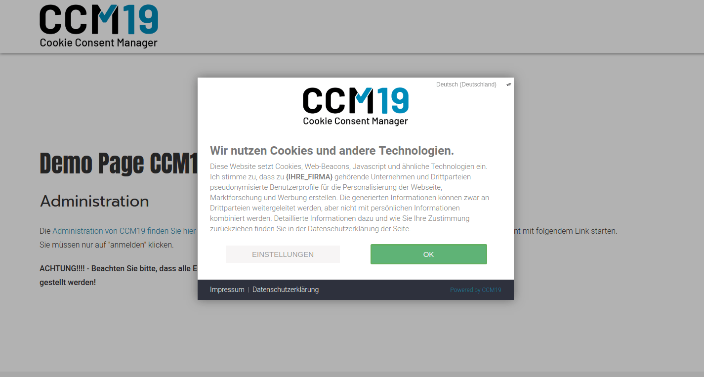

# Themes einrichten und nutzen

CCM19 ist komplett themefähig - d.h. Sie können alle Elemente des Frontends optisch anpassen. Sie können beliebig viele Themes ausprobieren. 

In jedem Theme können Sie mit Hilfe von einigen Buttons und Einstellmöglichkeiten das Theme definieren. Darüber hinaus haben Sie die Möglichkeit, mit Hilfe von CSS-Anweisungen jedes optische Detail anzupassen, die komplette Frontendmaske ist per CSS erreichbar. 

Verwenden Sie im Zweifel !important um Einstellungen Ihres CMS Systems zu überschreiben.


Theme Bearbeitung im CCM19

In der Oberfläche können Sie einiges einstellen. Die Einstellungen die Sie hier sehen, resultieren in dem folgenden Frontend.

## Frontend Overlay - Cookie Hinweis Box



Frontend Light Version

Die Buttons und Hintergrundfarben die Sie in der Administration einstellen, kommen direkt im Frontend an. Sie können ebenfalls die Links Impressum und Datenschutzerklärung optisch anpassen.

## Buttons & Einstellungen

Weiterhin gibt es die folgenden Buttons:

### Lebensdauer

Hier tragen Sie ein wie lange das CCM19 Cookie dass die Einstellung für das Cookie Management speichert laufen soll. Standard sind 365 Tage - Sie können aber jeden beliebigen anderen Wert dort eintragen.

### Position

Hier positionieren Sie das Overlay im Frontend, Sie können folgende Einstellungen wählen:

* links
* rechts
* oben
* unten
* mittig

### Blockierend

Blockierend bedeutet dass wie auf dem Screenshot zu sehen ist die Seite im Hintergrund blockiert ist und erst wenn sich ein Besucher definitiv entschieden hat ob er die [Cookies](https://www.ccm19.de/glossar/13-Cookies.html#13) akzeptiert oder nicht wird er auf die Seite gelassen.

### Do not Track Respekt

Wenn diese Einstellung angehakt wird - dann wird automatisch die Do not Track Einstellung im Browser respektiert und umgesetzt - d.h. es werden keine Tracking Cookies gesetzt.

### Nur in der EU anzeigen

Mit dieser Einstellung können Sie festlegen dass der Cookie Hinweis nur Besuchern aus der EU angezeigt wird. Die Auflösung erfolgt anhand der verwendeten IP des Besuchers und kann daher nicht 100%ig genau sein. Bei Besuchern aus anderen Ländern werden alle Cookies aktiviert, außer wenn der Besucher „Do Not Track“ signalisiert und „Do Not Track respektieren“ aktiviert wurde.

Dieses Produkt enthält GeoLite2-Daten von MaxMind, verfügbar auf [https://www.maxmind.com](https://5f3c395.ccm19.de/app/public/themes/&guot;https://www.maxmind.com&guot;).

### Logo des Seitenbetreibers

Hier laden Sie Ihr Logo hoch das im Frontend - also Ihre Webseite - im Overlay angezeigt wird. Im obigen Screenshot sehen Sie dort das Logo von ccm19 - das können Sie gegen Ihres tauschen.

### Logo anzeigen

Damit können Sie einstellen ob das Logo im Frontend im Overlay angezeigt werden soll.

### Powerd By CCM19 entfernen

Hier geht es um den Link im Frontend Overlay, der rechts unten steht. Dies ist ein Link der auf die CCM19 Seite verlinkt. Dieser kann durch setzen dieses Hakens entfernt werden. Allerdings ist dies nur möglich wenn vorher eine Whitelabel Lizenz für diese Installation erworben wurde.

### Farben

Hier stellen Sie für die verschiedenen Buttons und Hintergründe im Frontend die Farben ein - achten Sie hier darauf dass auch Rahmen teilweise davon abhängen, wenn Sie einen weißen Rahmen auf weißem Hintergrund setzen mit weißer Schrift sehen Sie natürlich nichts mehr. Am besten kontrollieren Sie jede Änderung einmal im Frontend indem Sie das Overlay neu aufrufen!

### CSS

Hier können Sie komplett individuelles CSS eintragen - für die einzelnen Elemente schauen Sie bitte in den Seiteninspektor Ihres Browsers. Im Zweifel müssen Sie Einstellungen per “!important” überschreiben - **Beispiel:**

```
.ccm-root button  
{ 
    border:1px solid #c2bcbc; 
} 
.ccm-control-panel--purpose > input[type="checkbox"] + label { color:#ccc;} 
.ccm-modal--footer { background-color:#26282f; }       
 
```