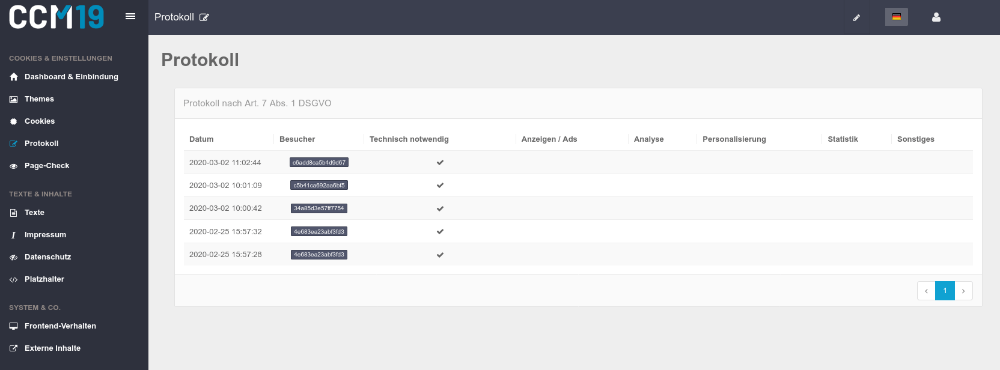
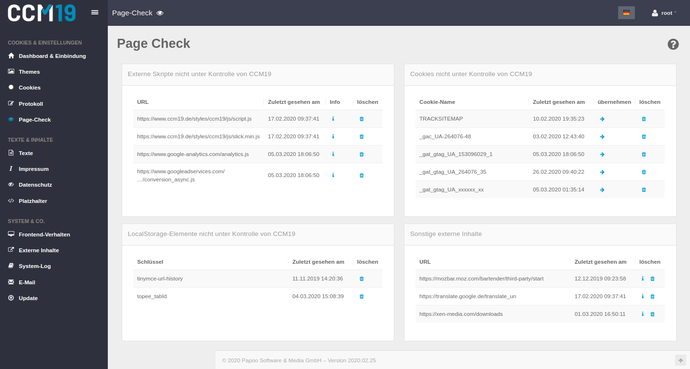
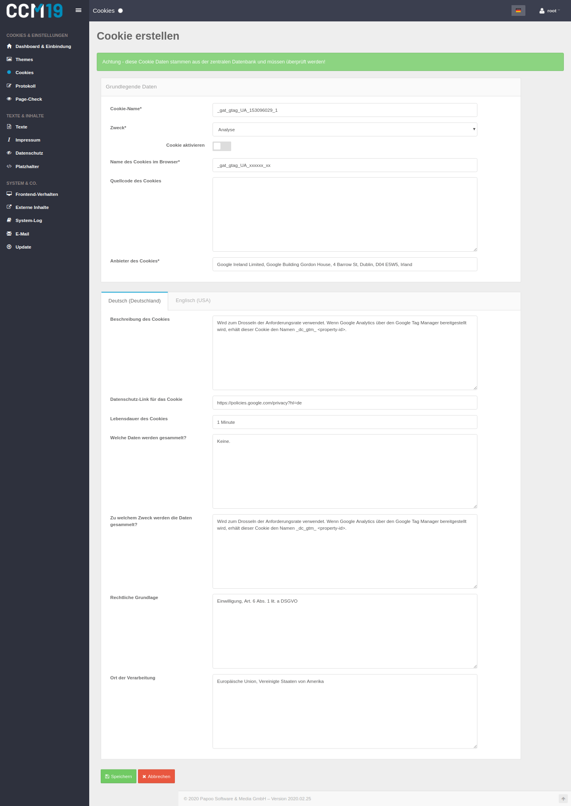

# Protokoll

Die Einwilligungen aller Besucher werden übersichtlich aufgelistet. Anhand einer ID sind Besucher eindeutig zu identifizieren, falls diese eine Auskunft über Ihre aktivierten Daten wünschen **und** Ihnen die eigene ID mitteilen. Ohne die Mitteilung bleiben diese Daten vollständig anonym da die ID eine Zufallszahl ist.

Die Protokollierung ist laut DSGVO Art 7, Abs. 1 zwingend vorgegeben. Selbstverständlich bleiben diese - wie auch alle anderen Daten - immer unter Ihrer Kontrolle und sind vollständig anonymisiert.

# Page Check

Der Page-Check hilft Ihnen, externe Scripte, [Cookies](https://www.ccm19.de/glossar/13-Cookies.html#13) und externe Inhalte zu finden bzw. zu kontrollieren. Die Tabellen zeigen Ihnen an, ob Cookies existieren, die Sie nicht kontrollieren oder ob Scripte außerhalb der Kontrolle von CCM19 ausgeführt werden.

Es ist wichtig diese Daten zu finden, da im Laufe der Zeit immer wieder mal Skripte in Teile der Seite integriert werden und nach einiger Zeit vergessen werden. Wer dokumentiert so etwas schon.

## Permanenter Cookie Scanner

**CCM19 überprüft permanent zur Laufzeit bei jedem Seitenaufruf ob alle Skripte, Cookies und sonstige relevanten Daten über CCM19 entweder benannt oder eingebunden, also kontrolliert werden.**

Falls das nicht der Fall ist, wenn z.B. Skripte am CCM19 vorbei in der Seite benutzt werden, bekommen Sie einen Hinweis in der Auflistung. Wir entwickeln derzeit ein Feature, welches bei einem neu entdeckten Skript eine E-Mail an den Betreiber versendet.

Wenn CCM19 ein neues Cookie findet - wie auf dem Screenshot zu erkennen ist, können Sie das Cookie mit Klick auf den Pfeil neben dem Cookienamen das Cookie in Ihre Liste übernehmen. Wenn das Cookie in unserer Datenbank bekannt ist, werden sogar direkt die passenden Einträge in Ihre Maske vorbelegt wie auf dem unten zu sehenden Screenshot zu erkennen ist.

