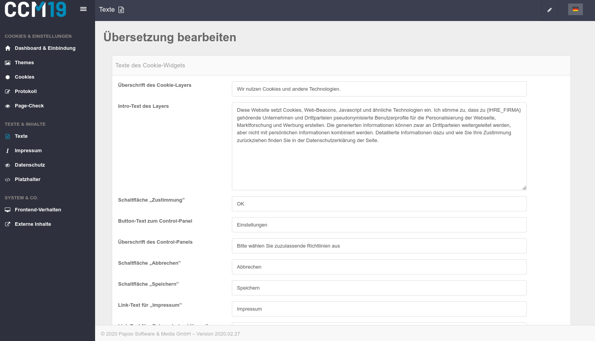

# Übersetzungen / Texte

Im Menüpunkt "Texte" (neu "Sprachen") können Sie festlegen welche Sprachen im System und für das Frontend verwendet werden sollen. Weiterhin können Sie hier die individuellen Texte eintragen und für Ihre Besucher ausgeben lassen.

Sie können die Texte des Cookie-Widgets, der Cookie-Detail-Seite, dem IFrame Blocker und die Kategorie-Texte anpassen. Alle Elemente finden Sie im Frotend wieder - Sie können hier nach belieben testen welche Bezeichnungen am besten funktionieren.

Eine noch weitergehende Individualisierung ist möglich - dafür muss man aber in den Quellcode und die Programmierung einsteigen.