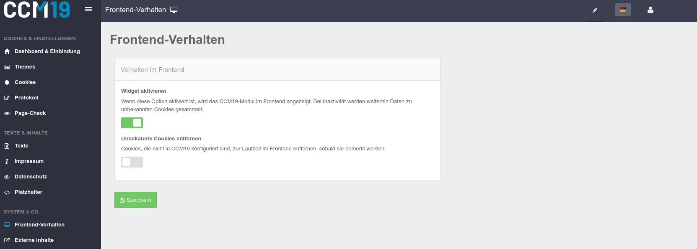

# Frontend Einstellungen

### Widget aktivieren

Ist dieser Punkt **deaktiviert**, wird das CCM19 Modul im Frontend **nicht** angezeigt und die entsprechend hinterlegten Scripte werden **nicht** ausgeführt. Daten zu unbekannten [Cookies](https://www.ccm19.de/glossar/13-Cookies.html#13) und Scripten werden auch bei deaktiviertem Widget weitergesammelt. 

Diese Funktion kann man nutzen um CCM19 auf der Webseite zu installieren, dann alles testen und erst wenn man alle Cookies und Skripte korrekt eingetragen hat CCM19 zu aktivieren.

### Unbekannte Cookies entfernen

CCM19 kann so konfiguriert werden, dass Cookies, die im Tool nicht hinterlegt sind, entfernt werden, sobald sie bemerkt werden.

Das funktioniert natürlich nur für First Party Cookies. Third Party Cookies die z.B. von iframes eingebunden werden können von der eigenen Seite technisch leider nicht angefasst und daher auch nicht gelöscht werden.

Daher muss man diese Skripte oder iframes vorher blocken - bevor sie die Cookies setzen.