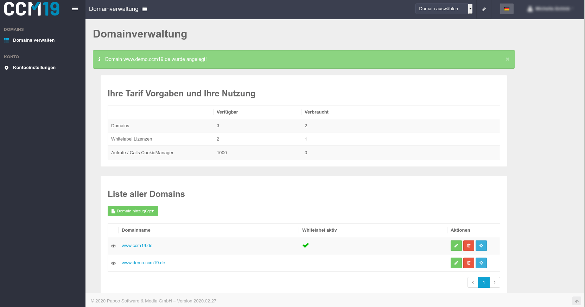

# Domainverwaltung

In der Domainverwaltung können Sie Ihre Domains anlegen und die Whitelabel-Funktion aktivieren oder deaktivieren. Außerdem sehen Sie einen Überblick darüber, wie viele Aufrufe (Calls) Ihnen zur Verfügung stehen und wie viele Aufrufe bereits verbraucht sind. Ebenso die Anzahl der Domains und die Anzahl der Whitelabel Lizenzen.

Die Domainverwaltung erreichen Sie über Ihren Namen oben rechts und dann den Punkt "Domainverwaltung".