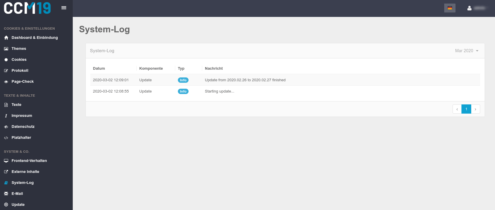

# System-Log

Im System-Log finden Sie alle Informationen, wie das System arbeitet. Wenn es Fehler gibt, können Sie diese hier nachlesen bzw. konkrete Fehlermeldungen an unseren Support weiterleiten. 

Ebenfalls wird bei jedem Update ein Logfile Eintrag erstellt. Das Loggin wird in Zukunft noch deutlich ausgeweitet.