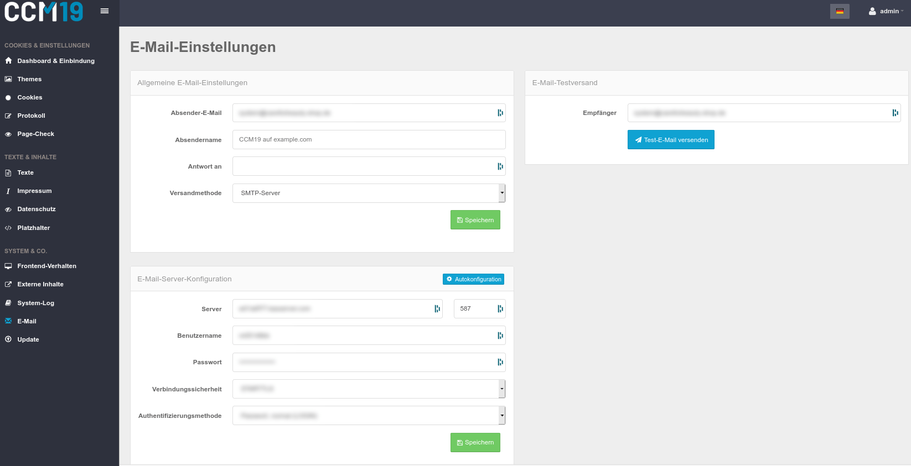

# E-mail Einstellungen

Die E-Mail Einstellungen zu setzen ist neben den [Cookies](https://www.ccm19.de/glossar/13-Cookies.html#13) selbst wohl die wichtigste Arbeit. Ohne die Korrekten E-Mail einstellungen können Sie z.B. die "Passwort vergessen?" Funktion nicht nutzen.
Tragen Sie eine Absender-Adresse ein und probieren Sie, ob das System mit der Versandmethode "Sendmail" korrekt arbeitet. Sollte dem nicht so sein und die E-Mail kann nicht verschickt werden, wählen Sie als Versandmethode "SMTP-Server" aus und tragen Sie die Daten Ihres Mail-Servers in die Maske ein.