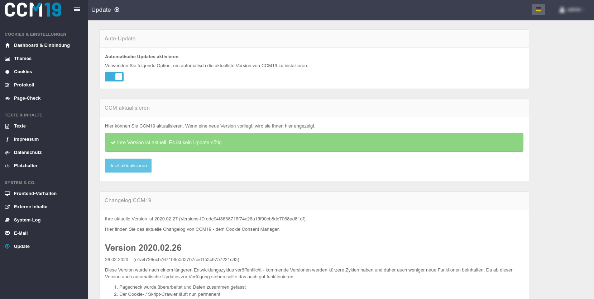

# Updates

Durch die Update-Funktion bekommen Sie immer die aktuellste und neuste stabel-Version des CCM19 Tools.
Im Changelog können Sie sehen, was für Änderungen vorgenommen wurden. Durch das aktivieren der Funktion "Automatische Updates aktivieren" wird Ihr CCM19 System automatisch aktualisiert.