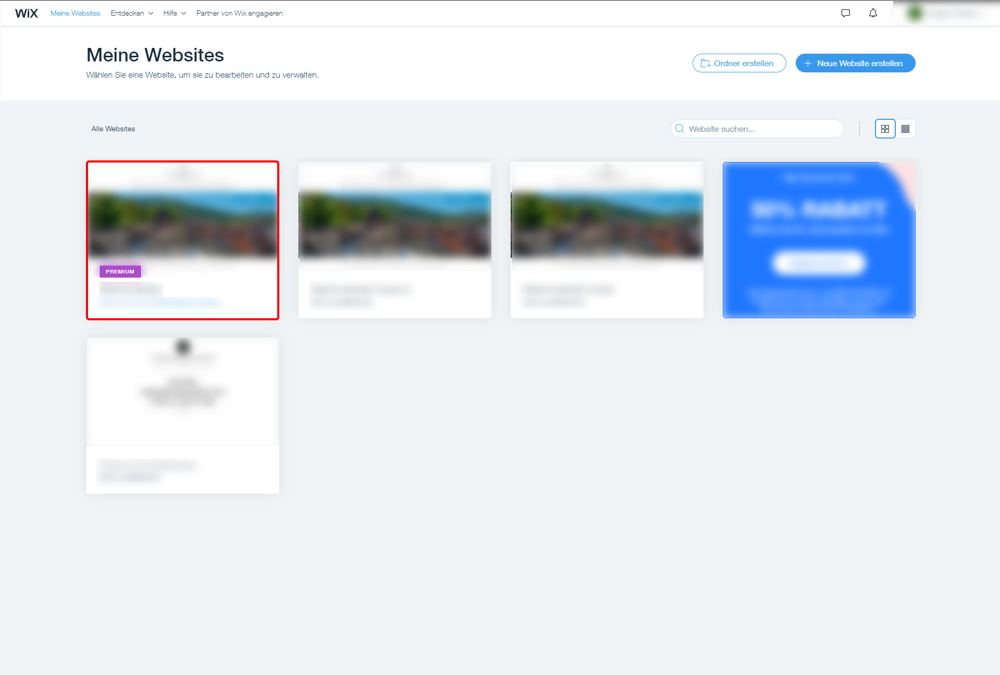
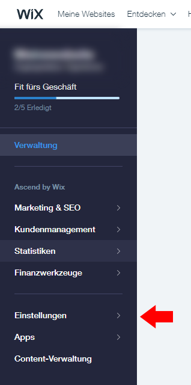

# Wix

Um unseren Cookie [Consent](https://www.ccm19.de/integration/glossar/10-Consent.html#10) Manager für Ihren Wix-Blog oder Ihre Wix-Webseite zu installieren, führen Sie einfach die folgenden Schritte aus:

\1. Melden Sie sich bei Ihrem Wix-Account an.

\2. Wählen Sie in der Übersicht für die Webseiten, die Webseite aus, in der Sie CCM19 einbinden möchten.

\3. Öffnen Sie in der Verwaltung für die Webseiten die Einstellungen.

\4. In der Übersicht für die Einstellungen öffnen Sie im Bereich der "Erweiterten Einstellungen" den Punkt "Analysewerkzeuge".

\5. Nun sehen Sie drei Bereiche in denen Sie Werkzeuge hinzufügen können. Wir möchten das CCM19 im Kopf-Bereich, an der ersten Stelle einbauen.

\6. Klicken Sie auf "+ Neues Werkzeug" und wählen Sie "Benutzerdefiniert" aus.

\7. Zuerst, wählen Sie einen Namen für das Werkzeug aus z. B. "CCM19". Als nächstes, fügen Sie in dem Abschnitt für den Code das Skript für CCM19 ein (Im Bild ist nur ein Beispiel). Anschließend wählen Sie im Bereich "Code zu Seite hinzufügen" "alle Seiten" aus und dass der Code auf jeder Seite neu geladen wird. Nun wählen Sie den Head-Bereich als Ausgabe aus. Nach dem Speichern des Werkzeugs, achten Sie darauf, dass CCM19, an erster Stelle steht und kein anderes Werkzeug davor positioniert ist.

\8. Et voilà, nun sollte der Cookie [Consent](https://www.ccm19.de/integration/glossar/10-Consent.html#10) Manager auf Ihrer Webseite eingebunden sein und Cookiemeldungen einblenden, wenn das Widget im Tool selbst aktiviert wurde. Nun müssen Sie dieses nur noch für Ihrer Webseite konfigurieren.