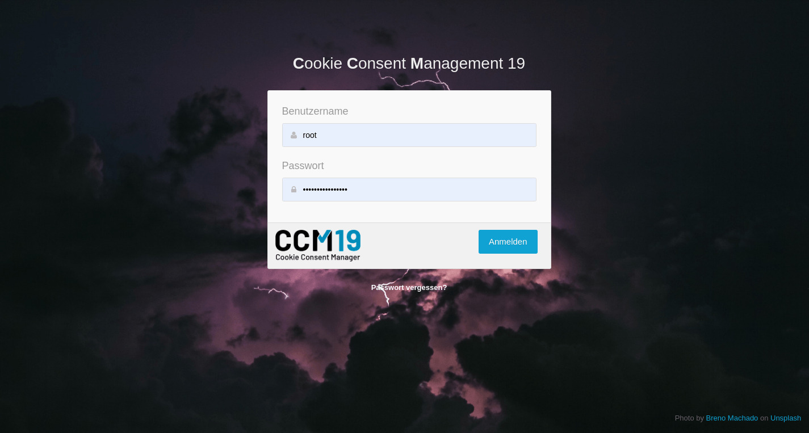

# Login & Passwörter

Wenn Sie das CCM19 aufrufen - egal mit welcher Version - sehen Sie als erstes das Loginfenster. Loggen Sie sich dort mit ihren Accountdaten ein. Falls Sie Ihr Passwort vergessen haben, könenn Sie die “Passwort vergessen” Option nutzen. Allerdings funktioniert diese nur wenn Sie korrekte E-Mail Kontaktdaten in der Administration von CCM19 eingetragen haben.

In diesem Fenster bekommen Sie auch Fehlermeldungen angezeigt falls etwas beim Login nicht mehr korrekt ist.

 

## Lizenz nicht mehr gültig

Falls Sie Ihre Lizenz deaktiviert haben oder sie aus anderen Gründen nicht mehr gültig ist, bekommen Sie beim Login einen Hinweis angezeigt.