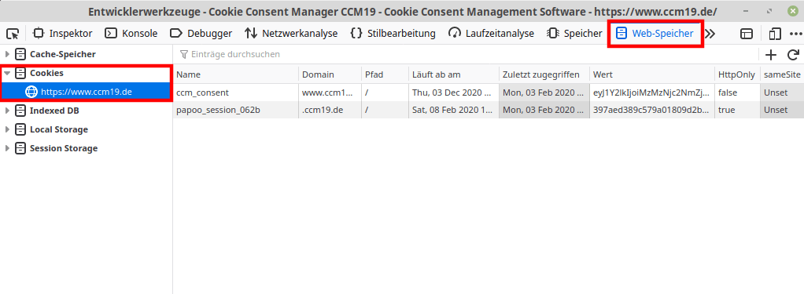

# Cookies

## Übersicht über die Cookie Felder

Bei der Neuerstellung von Cookies müssen Sie einiges beachten. Wir gehen in diesem Schritt beispielhaft an dem Cookie aus Google Analytics vor und beschreiben, welches Feld welchen Zweck hat:

| Name des Feldes                              | Erklärung                                                    |
| :------------------------------------------- | :----------------------------------------------------------- |
| Cookie-Name                                  | Der Name des Cookies wird später als Titel im Panel ausgegeben. |
| Zweck                                        | Beim Zweck können Sie zwischen Unterschiedlichsten Kategorien wählen. Eigentlich gibt es aber nur 2 Unterschiede. Die **technisch notwendigen** Cookies werden standardmäßig akzeptiert. Alle anderen werden dem Benutzer zur Akzeptanz vorgelegt. |
| Name des Cookies im Browser                  | So heißt das Cookie im Browser. Wie Sie herausfinden, welche Cookies in Ihrem Browser sind und heißen lesen Sie [hier](https://www.ccm19.de/cookies-einstellen.html#cookie-research).  Sollte der Cookie eine zufällige Auflistung von Zahlen und Buchstaben sein (wie das häufig bei Session-Cookies der Fall ist) können Sie auch "zufällig generierte Zeichenfolge" in dem Feld eintragen. |
| Quellcode des Cookies                        | Beim Quellcode des Cookies müssen Sie den Code einfügen, durch den der Cookie generiert wird. In unserem Beispiel wäre dies der Google Analytics-Code.**Wenn Sie einen Code einfügen, muss dieser einmalig sein und darf in keinem anderen Cookie eingetragen werden. Außerdem muss er aus dem direkten Webseitentext entfernt werden.** |
| Anbieter des Cookies                         | Der Anbieter des Cookies sind meistens die Firmen, die Ihnen den Service zur Verfügung stellen. In unserem Fall wäre es Google Ireland Limited. Tragen Sie hier auch gerne direkt die komplette Adresse des Unternehmens ein. |
| Beschreibung des Cookies                     | Bei der Beschreibung des Cookies tragen Sie die Aufgabe des Cookies ein. Wieso wird es gesetzt ? |
| Datenschutz-Link für das Cookie              | Hier tragen Sie den Datenschutz-Link des Cookie-Erstellers ein. In unserem Beispiel wäre es der Link auf die Privacy policies von Google. |
| Lebensdauer des Cookies                      | Die Lebensdauer können Sie ebenfalls über Ihren Browser herausfinden. Wie das geht lesen Sie [hier](https://www.ccm19.de/cookies-einstellen.html#cookie-research). |
| Welche Daten werden gesammelt?               | Wohl die schwierigste Frage in diesem Prozess... Hier können wir leider meist auch nur googeln, Anfragen an Unternehmen stellen und abwarten. |
| Zu welchem Zweck werden die Daten gesammelt? | Der Zweck wird meist schon in der Beschreibung beantwortet. Achten Sie hierbei darauf, dass es hier um den **Zweck** des Cookies geht. Nicht um seine Beschreibung. |
| Rechtliche Grundlage                         | Bei der Rechtlichen Grundlage gibt es eigentlich nur eine richtige Antwort: *Für die Verarbeitung von personenbezogenen Daten bedarf es einer rechtlichen Grundlage gemäß Art. 6 I 1 DSGVO.* |
| Ort der Verarbeitung                         | Der Ort der Verarbeitung ist bei großen Unternehmen immer recht schwierig herauszufinden. Im Fall von Google Analytics wäre die Europäische Union und die Vereinigte Staaten von Amerika. |

------

## Cookies der eigenen Seite manuell bestimmen

Wir haben für verschiedene Browser eine individuelle Anleitung zusammengestellt.

## Cookies im Firefox finden

Um zu erkennen, welche Cookies Ihre Webseite verwendet, führen Sie folgende Schritte durch:

Klicken Sie an irgendeinem Punkt der Webseite mit der rechten Maustaste und drücken Sie auf die Schaltfläche 

**Element untersuchen (Q)**

Im sich nun öffnenden Fenster klicken Sie in der oberen Leiste auf **Web-Speicher**, danach in der linken Spalte auf **Cookies** und danach auf Ihre Seite.

Zur Sicherheit sollten Sie vorher noch einmal alle Cookies löschen und die Seite neu besuchen. Somit stellen Sie sicher, dass Sie keine alten Cookies oder Cookies die Sie noch gesetzt hatten ins System eintragen.

Der **Name** entspricht hierbei dem [**Cookie-Namen im Browser**](https://www.ccm19.de/cookies-einstellen.html#Cookiename-im-browser). Der Wert **Läuft ab am** entspricht der **[Laufzeit des Cookies](https://www.ccm19.de/cookies-einstellen.html#Cookielebensdauer)**. Webseiten wie der[ Zeitspannenrechner (externer Link)](https://www.timeanddate.de/datum/zeitspanne?) helfen dabei, die korrekte Zeitspanne zu berechnen.

## Cookies im Chrome finden

Um zu erkennen, welche Cookies Ihre Webseite verwendet, führen Sie folgende Schritte durch:

Klicken Sie an irgendeinem Punkt der Webseite mit der rechten Maustaste und drücken Sie auf die Schaltfläche **Untersuchen**. (oder STRG + Shift + I) 

Im sich nun öffnenden Fenster klicken Sie in der oberen Leiste auf **Application**, danach in der linken Spalte auf **Cookies** und danach auf Ihre Seite.

Zur Sicherheit sollten Sie vorher noch einmal alle Cookies löschen und die Seite neu besuchen. Somit stellen Sie sicher, dass Sie keine alten Cookies oder Cookies die Sie noch gesetzt hatten ins System eintragen.

Der **Name** entspricht hierbei dem [**Cookie-Namen im Browser**](https://www.ccm19.de/cookies-einstellen.html#Cookiename-im-browser). Der Wert **Expires/Max-Age** entspricht der **[Laufzeit des Cookies](https://www.ccm19.de/cookies-einstellen.html#Cookielebensdauer)**. Webseiten wie der[ Zeitspannenrechner (externer Link)](https://www.timeanddate.de/datum/zeitspanne?) helfen dabei, die korrekte Zeitspanne zu berechnen.

## Cookies im Edge finden

Um zu erkennen, welche Cookies Ihre Webseite verwendet, führen Sie folgende Schritte durch:

Öffnen Sie die gewünschte Webseite und drücken Sie die Taste F12. Jetzt sollte sich auf der rechten Seite die Entwicklerkonsole öffnen. In diesem Fenster klicken Sie in der oberen Leiste auf **Speicher** (falls nicht vorhanden auf den kleinen Pfeil an der rechten Seite) und danach auf den Punkte **Cookies** und dann Ihre Webseite.

Zur Sicherheit sollten Sie vorher noch einmal alle Cookies löschen und die Seite neu besuchen. Somit stellen Sie sicher, dass Sie keine alten Cookies oder Cookies die Sie noch gesetzt hatten ins System eintragen.

Der **Name** entspricht hierbei dem [**Cookie-Namen im Browser**](https://www.ccm19.de/cookies-einstellen.html#Cookiename-im-browser). Der Wert **Expires/Max-Age** entspricht der **[Laufzeit des Cookies](https://www.ccm19.de/cookies-einstellen.html#Cookielebensdauer)**. Webseiten wie der[ Zeitspannenrechner (externer Link)](https://www.timeanddate.de/datum/zeitspanne?) helfen dabei, die korrekte Zeitspanne zu berechnen.

 

