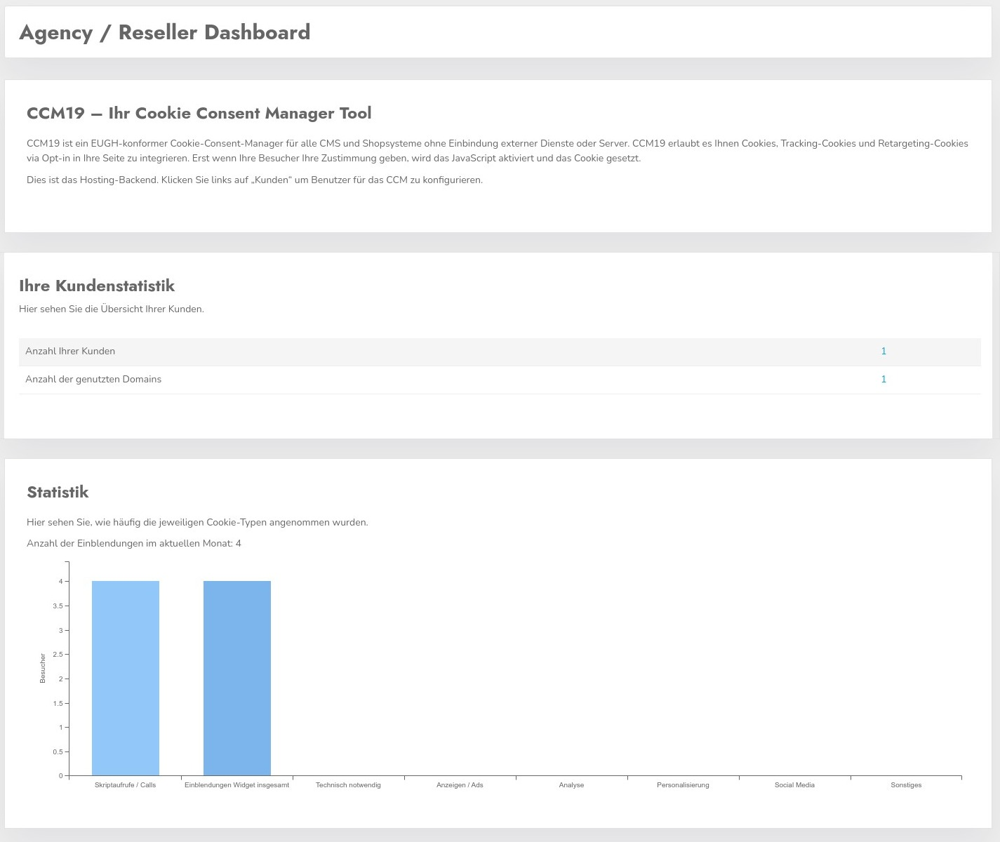

# Enterprise / Agency Version

The Enterprise or Agency version has various special features that are especially relevant for larger companies or agencies. The use case is relatively similar in terms of usage, as it is about managing various domains of mostly independent entities.

**First of all it is the multi-client capability, the customer/client API, the maintenance of an own individual and cross-account cookie and scripts database and own themes

In addition, the Enterprise / Agency version can also be implemented as a complete whitelabel version, where both the frontend and the backend are completely individualized and all references to CCM19 are removed.

With the Agency version you also have the possibility to connect CCM19 to your customer management or to create and edit new customers via API.

## Installation Enterprise / Agency Version OnPremise

**In general CCM19 will do the installation for you,** You can of course do it yourself,the installation of the Agency Version is the same as the [download variant](/first_steps/installation/) - the process is the same. You only get a special download file and a special license key that enables the usage.

**The Enterprise Version can also be used on a CCM19 subdomain, e.g. unternehmen.ccm19.de - just talk to our support for that.**

## Enterprise / Agency Dashboard

The dashboard provides some basic information about the usage of the Agency version. For example how many customers are in the database and how many domains are used. You can also see a small graph showing the usage of your CCM19 instance in the current month.

 More information can be found in the menu on the left.