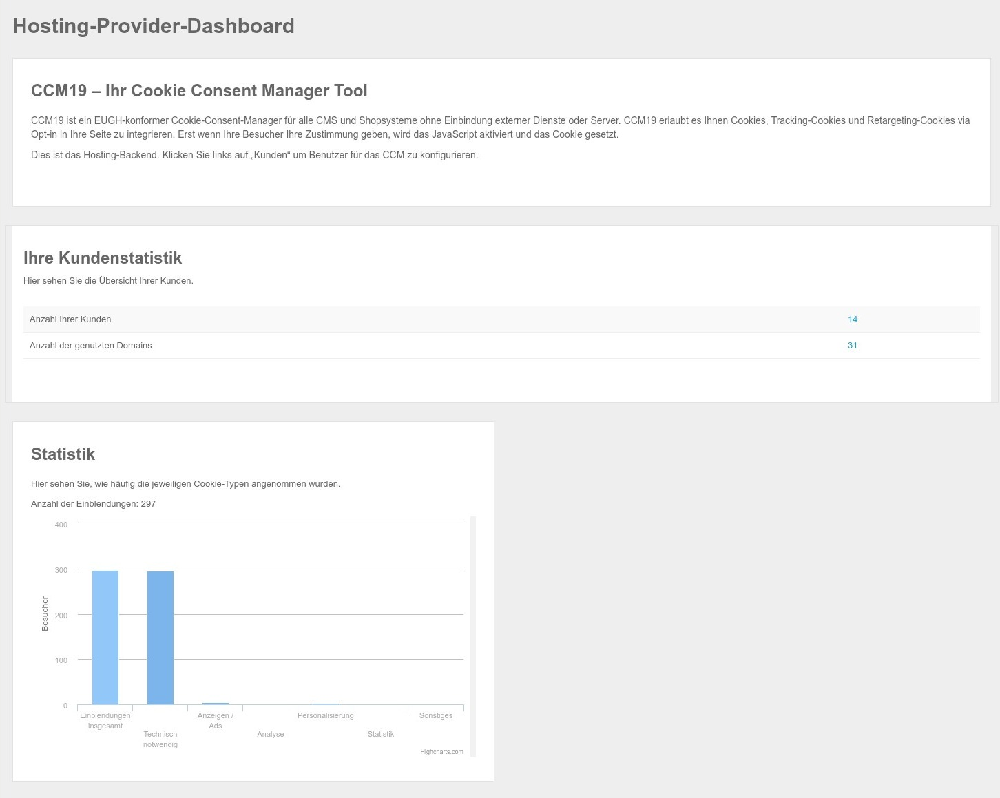

# Agency Version

Die Agency Version verfügt über einige spezielle Features, die speziell Agenturen oder andere Wiederverkäufer optimal nutzen können.

Zusätzlich kann die Agency Version auch als komplette Whitelabel Version umgesetzt werden, wo sowohl das Frontend wie auch das Backend komplett individualisiert sind und alle Hinweise auf CCM19 entfernt sind.

Mit der Agency Version haben Sie auch die Möglichkeit das CCM19 an Ihre Kundenverwaltung anzuschließen oder per API neue Kunden zu erstellen und zu bearbeiten.

## Installation

Die Installation der Agency Version erfolgt genauso wie die Downloadvariante - der Prozess ist der gleiche. Sie bekommen nur eine spezielle Downloaddatei und einen speziellen Lizenzkey der die Nutzung ermöglicht.

 [Installation CCM19](../erste_schritte/installation.md) 

## Agency Dashboard

Das Agency Dashboard bietet einige Basisinformationen über die Nutzung der Agency Version. Zum einem wieviel Kunden in der Datenbank vorliegen und wieviele Domains darüber genutzt werden.

Außerdem sehen Sie eine kleine Grafik die die Auslastung Ihrer CCM19 Instanz zeigt.

