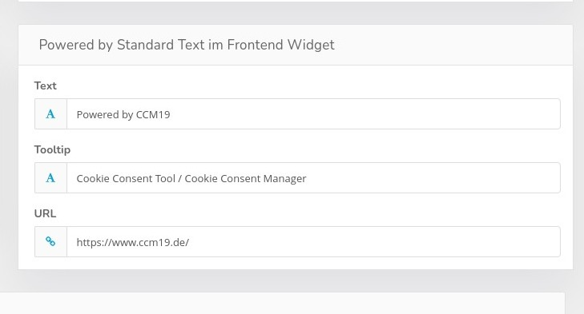
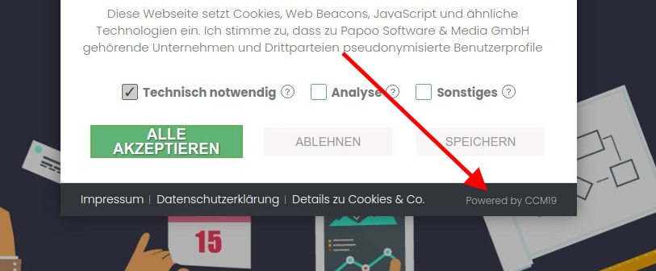
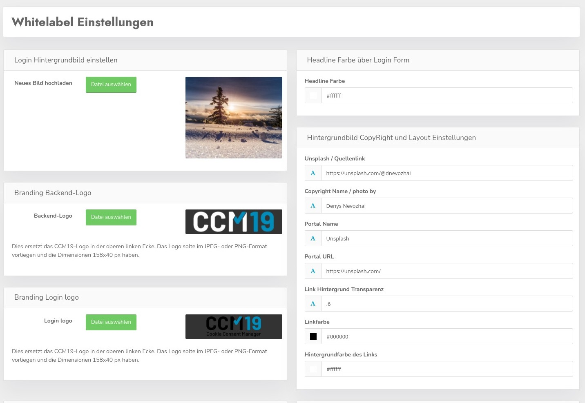
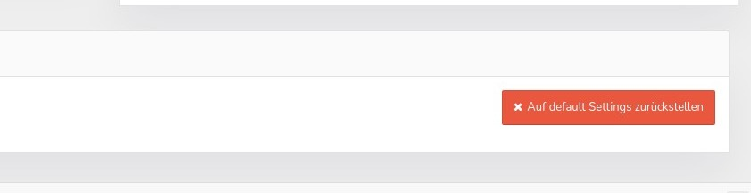

# Whitelabel settings

<<<<<<< HEAD
Under Settings in the Standard Agency Version you have the possibility to make different settings.

All agency versions can change the following settings.

These are the default whitelabel links in the footer of your clients' widgets. So you can always have it link to your site from there or hide it completely. This is possible for each of your customers.

**It is about this area
=======
Unter Einstellungen steht Ihnen in der Standard Agency Version die Möglichkeit zur Verfügung verschiedene Einstellungen durchzuführen.

Alle Agentur Versionen können die folgenden Einstellungen ändern.

Das sind die Standard Whitelabel Links im Fuß der Widgets Ihrer Kunden. So können Sie von dort aus immer auf Ihre Seite verlinken lassen oder es komplett ausblenden. Das ist für jeden Ihrer Kunden möglich.

**Es geht dabei um diesen Bereich.**
>>>>>>> 1645c8cc3b2bc5e319fd50eee77ddfaad579bf1b

## Agency Whitelabel Version

<<<<<<< HEAD
In the Whitelabel Version you have much more functions available at this point, you can completely customize the look of both the frontend and the backend to your ideas and CI with the available functions.

### Login background image

You can change the background image of your installation by uploading an image there. Also the credentials / copyright notices can be changed dynamically in the right pane.

**Headline Color**

This is the color of the text above the login area

**Source link**

Where the photo is from - e.g. Unsplash

**Photographer's name**

Detailed source information

**Portal name**

From which image portal does it originate.

**Portal URL**

The exact URL of the portal.

**Colors**

Here you can change link color, transparency and background color of the link area.

### Branding logos

You can upload your own logos in this area for both the backend and the login screen.

## Link documentation
=======
In der Whitelabel Version stehen Ihnen an dieser Stelle wesentlich mehr Funktionen zur Verfügung, Sie können mit den verfügbaren Funktionen die Optik sowohl des Frontends als auch des Backends komplett an Ihre Ideen und CI anpassen.

### Login Hintergrundbild

Sie können das Hintergrundbild Ihrer Installation ändern indem Sie dort ein Bild hochladen. Auch die Credentials / Copyright Hinweise lassen sich dynamisch im rechten Bereich ändern.

**Headline Farbe**

Das ist die Farbe des Textes oberhalb des Loginbereiches

**Quellenlink**

Woher das Foto stammt - z.B. Unsplash

**Name des Fotografen**

Detaillierte Quellenangabe

**Portal Name**

Von welchem Bilderportal stammt es.

**Portal URL**

Die genaue URL des Portals.

**Farben**

Hier können Sie Linkfarbe, Transparenz und Hintergrundfarbe des Linkbereiches ändern.

### Branding Logos

Sie können in dem Bereich eigene Logos hochladen sowohl für das Backend als auch für die Loginmaske.

## Dokumentation verlinken
>>>>>>> 1645c8cc3b2bc5e319fd50eee77ddfaad579bf1b

<<<<<<< HEAD
Here you can also link the documentation to your own installation, so the use of the Github repo really makes sense. This can then be cloned and then realize a separate documentation installation which is then also directly linked to the interface.

Additionally you can hide the help icon if you want. So that it does not link to us if you have no WL documentation.

### Reset to default

The red reset button resets all settings back to default and deletes everything that was changed in there
=======
Hier kann man nun auch die Dokumentation auf eine eigene Installation verlinken lassen, so macht die Nutzung des Github Repos auch wirklich Sinn. Das läßt sich dann klonen und daraus dann eine eigene Doku Installation realisieren die dann auch direkt mit der Oberfläche verbunden ist.

Zusätzlich kann man das Hilfe Icon ausblenden so man denn möchte. Damit es da nicht zu uns verlinkt falls man keine WL Doku hat.

### Reset auf Default

Der rote Reset Button setzt alle Einstellungen wieder auf Standard zurück und löscht alle was da drin geändert wurde
>>>>>>> 1645c8cc3b2bc5e319fd50eee77ddfaad579bf1b
