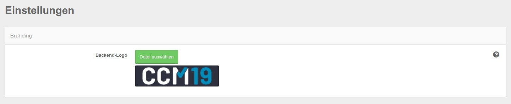
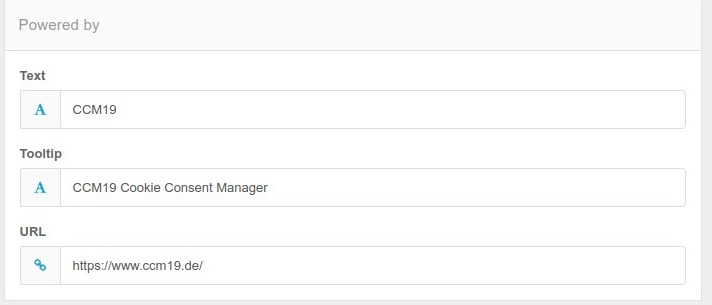
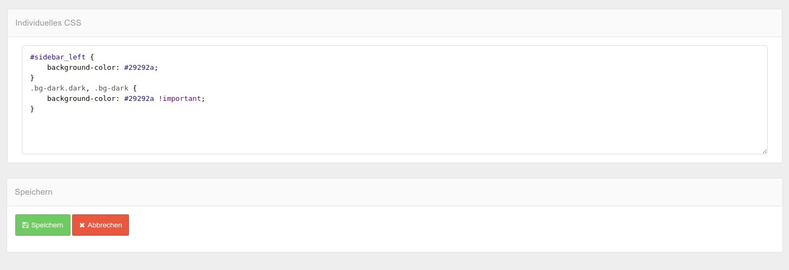
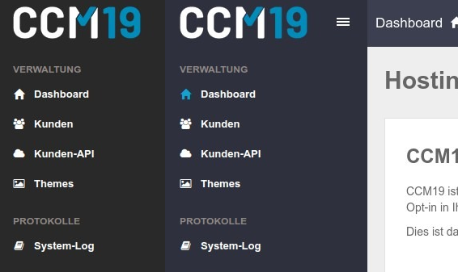
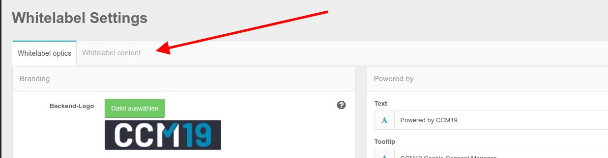
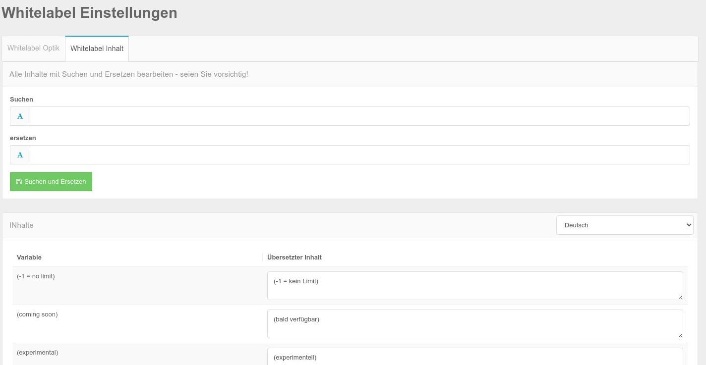

# Whitelabel Einstellungen

Unter Einstellungen steht Ihnen in der Standard Agency Version die Möglichkeit zur Verfügung das Logo in der Administration oben links auszutauschen.

## Agency Whitelabel Version

In der Whitelabel Version stehen Ihnen an dieser Stelle wesentlich mehr Funktionen zur Verfügung, Sie können mit den verfügbaren Funktionen die Optik sowohl des Frontends als auch des Backends komplett an Ihre Ideen und CI anpassen.

## Powered By Text im Frontend Widget

Den Powered By Text können Sie mit Hilfe dieses Bereiches an Ihr Unternehmen anpassen. 

Den Text können Sie hier bearbeiten und an Ihr Unternehmen anpassen.

## Layout der Administration 

Sie können das Layout der Administration komplett an Ihre Anforderungen anpassen. Jedes Element kann per CSS angefasst und gestylt werden. So ist ein vollständig eigenes Layout möglich - ganz einfach durch ein paar Einträge in dem folgenden Feld.

Allein diese beiden Einträge verändern das Layout der Adminstration schon stark, Hier sind der Umsetzung optisch nur die Grenzen gesetzt die CSS übersteigen. Beispiel mit Auswirkung der obigen Einträge, links mit Ergänzung, rechts Standard.

Das Layout in dieser Form wird natürlich auch direkt für Ihre Kunden ausgespielt.

## Whitelabel Texte

Alle Texte und Ausgaben können in der Whitelabel Version an Ihre Vorgaben angepasst werden. Klicken Sie dafür auf den Reiter Whitelabel Content / Inhalt

Nach dem Klick kommen Sie in folgende Maske

### Inhalte bearbeiten

Hier sehen Sie die Auflistung aller Spracheinträge in der Administration, diese können Sie entweder einzeln anpassen oder "on block" mit der Suchen und Ersetzen Funktion. Falls Sie sich einmal dabei total verhauen, im Verzeichnis `/messages` werden Sicherung von der jeweiligen Vorversion gespeichert. Zur Not können Sie also wieder zurückspringen indem Sie die Dateien umkopieren.

> Auf diese Weise können Sie z.B. auch den Namen "CCM19" gegen Ihre Bezeichnun ersetzen. Ebenfalls den Namen unseres Unternehmens im Fuß der Administration -  das kann **alles** angepasst werden.

