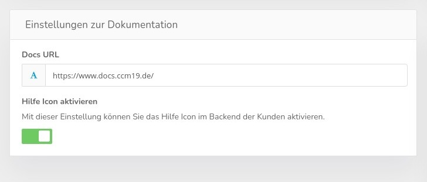

# Whitelabel settings

Under Settings in the Standard Agency Version you have the possibility to make different settings.

All agency versions can change the following settings.

These are the default whitelabel links in the footer of your clients' widgets. So you can always have it link to your site from there or hide it completely. This is possible for each of your customers.

**It is about this area

## Agency Whitelabel Version

In the Whitelabel Version you have much more functions available at this point, you can completely customize the look of both the frontend and the backend to your ideas and CI with the available functions.

### Login background image

You can change the background image of your installation by uploading an image there. Also the credentials / copyright notices can be changed dynamically in the right pane.

**Headline Color**

This is the color of the text above the login area

**Source link**

Where the photo is from - e.g. Unsplash

**Photographer's name**

Detailed source information

**Portal name**

From which image portal does it originate.

**Portal URL**

The exact URL of the portal.

**Colors**

Here you can change link color, transparency and background color of the link area.

### Branding logos

You can upload your own logos in this area for both the backend and the login screen.

## Link documentation

Here you can also link the documentation to your own installation, so the use of the Github repo really makes sense. This can then be cloned and then realize a separate documentation installation which is then also directly linked to the interface.

Additionally you can hide the help icon if you want. So that it does not link to us if you have no WL documentation.

### Reset to default

The red reset button resets all settings back to default and deletes everything that was changed in there
