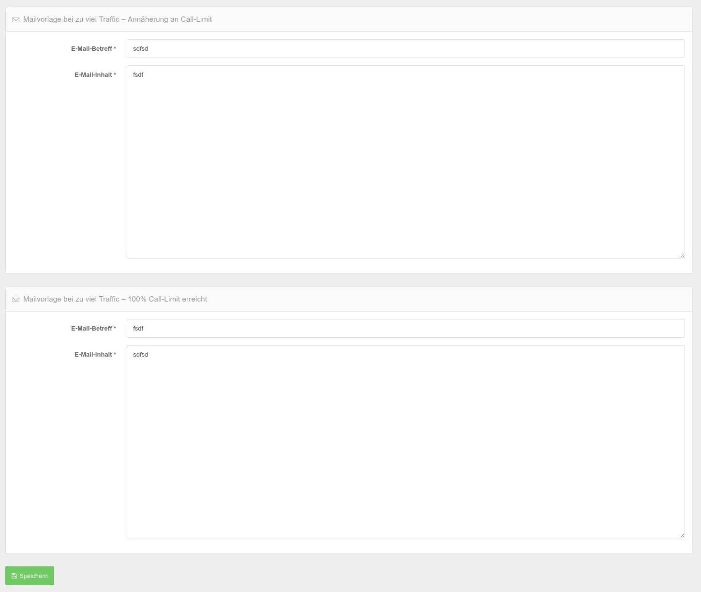

# E-Mail

Der E-Mail Bereich für die Agency Version ist erweitert im Vergleich zur Downloadversion. Die grundsätzlichen Einstellungen sind aber identisch und sind hier zu finden: [Standard Mail Einstellungen](../system-und-co/email.md) 

## Quota Mails

Wenn Sie ein Quota für die Zugriffszahlen nutzen, gehen automatisch bei Annährung an das Quota Mails an die Kunden raus die darauf hinweisen. 

Sie können einstellen dass der Admin oder eine andere E-Mail Adresse eine Kopie der Quota Mails bekommt.

.jpg)

## Quota Mails Vorlagen resp. Inhalt

Die Quota Mails selber können Sie hier vorbelegen. Dabei stehen folgende Variablen zur Verfügung. Die Synthax muss dabei beachtet werden - die geschweiften Klammern sind obligatorisch {{ varname }}.

| Variablen          | Inhalt                                                       |
| ------------------ | ------------------------------------------------------------ |
| {{ callMaxCount }} | Die Anzahl der verfügbaren Aufrufe im jeweils gewählten Tarif |
| {{ quota }}        | Der numerische Wert des prozentualen Verbrauchs - d.h. wenn 94% verbraucht sind enthält die Variable den Wert 94 |
| {{ username }}     | Benutzername des Kunden                                      |
| {{ email }}        | E-Mail Adresse des Kunden                                    |

## Mail Templates

Die Variablen können im Fließtext der Mails verwendet werden.

