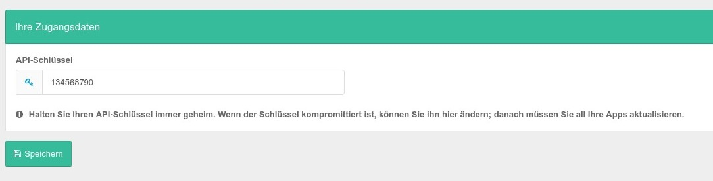

# Kunden API

Informationen zu Ihrer Kunden API finden Sie im Admin Dashboard unter dem Menüpunkt Kunden-API. Mit Hilfe der Kunden API können Sie folgende Aktionen durchführen.

* Kunden erstellen
* Kundendaten auslesen
* Kundendaten bearbeiten / aktualisieren
* Kunde löschen
* Alle KundenIds mit Domaindaten für Statistische Daten auslesen
* Mit einem String nach einer KundenID suchen

Natürlich können alle diese Aktionen nur durchgeführt werden wenn eine entsprechende Autorisierung vorliegt.

## Verbindung zur API herstellen

Um eine API-Anfrage erfolgreich zu verarbeiten, hängen Sie den API-Schlüssel an **jede Anfrage** an, indem Sie den GET-Parameter `apiKey` hinzufügen und den Schlüssel als Wert festlegen.

Setzen Sie für jede POST- und PUT-Anfrage den HTTP-Header `Content-Type` auf `application/json`; d.h. für jede Anfrage, die einen Nachrichtenkörper enthält. Kodieren Sie den zu sendenden Payload entsprechend.



Die echten API Schlüssel sind natürlich wesentlich komplexer ;-) 

> **Halten Sie Ihren API-Schlüssel immer geheim. Wenn der Schlüssel kompromittiert ist, können Sie ihn hier ändern; danach müssen Sie all Ihre Apps aktualisieren.**


## Hawk HTTP-Authentifizierung verwenden

Wenn Sie diese Option aktivieren, kann eine signierte Anfrage verifiziert werden. Die Clientseite für diese Authentifizierungsmethode müssen sie jedoch selbst implementieren und in Ihre Anwendungen integrieren.

Verwenden Sie das Shared Secret, um Ihre Anfragen zu signieren. Dazu müssen Sie mithilfe des `PBKDF2`-Algorithmus einen Schlüssel aus dem Shared Secret ableiten. 


## Hawk HTTP-Authentifizierung verwenden

Wenn Sie diese Option aktivieren, kann eine signierte Anfrage verifiziert werden. Die Clientseite für diese Authentifizierungsmethode müssen sie jedoch selbst implementieren und in Ihre Anwendungen integrieren.

Verwenden Sie das Shared Secret, um Ihre Anfragen zu signieren. Dazu müssen Sie mithilfe des `PBKDF2`-Algorithmus einen Schlüssel aus dem Shared Secret ableiten. 

> Diese Funktion ist optional. Verwenden Sie diese Option, um eine teilweise kryptografische Verifizierung Ihrer Anfragen zu ermöglichen.

Sehen Sie sich folgende Ressourcen an, um Ihre Anfragen korrekt zu signieren.

- [Hawk — A PHP Implementation](https://github.com/dflydev/dflydev-hawk#building-a-client)
- [hash_pbkdf2 — Generate a PBKDF2 key derivation of a supplied password](https://www.php.net/manual/en/function.hash-pbkdf2.php)


# API Endpunkte

Es gibt insgesamt 4 verschieden API Endpunkte die Sie nutzen können, im einzelnen sind das:

## Kunden erstellen

**URL** `http://localhost/ccm19/cookie-consent-management/www/public/hosting/api/client`

**Methode** `POST`

**Nachrichtenkörper**

- `username`: *string*
- `password`: *string* – Das Passwort des Kunden in Klartext
- `passwordHash`: *string* – **[optional]** Ein vorberechneter Passwort-Hash (bcrypt: *$2y$*); `password` hat Vorrang
- `active`: *bool* – **[optional]** *(Standardwert: false)* Gibt an, ob sich der Kunde einloggen kann.
- `firstName`: *string* – **[optional]**
- `lastName`: *string* – **[optional]**
- `emailAddress`: *string*
- `company`: *string* – **[optional]**
- `domainMaxCount`: *int* – **[optional]** *(Standardwert: 0)* Maximale Anzahl an Domains, die ein Kunde in seinem Account verwalten kann; -1 ist unbegrenzt
- `whitelabelMaxCount`: *int* – **[optional]** *(Standardwert: 0)* Maximale Anzahl an Whitelabel-Lizenzen, die einem Kunden zur Verfügung stehen; -1 ist unbegrenzt
- `widgetDisplayMaxCount`: *int* – **[optional]** *(Standardwert: 0)* Legt fest, wie häufig das CCM19-Widget im Frontend pro Monat geladen wird; -1 ist unbegrenzt


**Antwort (HTTP Status-Codes)**

* 201– Kunde wurde erfolgreich erstellt.
  * `id`: *string*
  * `username`: *string*
  * `active`: *bool*
  * `firstName`: *string*
  * `lastName`: *string*
  * `emailAddress`: *string*
  * `company`: *string*
  * `domainMaxCount`: *int*
  * `whitelabelMaxCount`: *int*
  * `widgetDisplayMaxCount`: *int*

- `400` – Benutzername oder Passwort ist leer.
- `400` – Benutzername wird bereits verwendet.
- `400` – E-Mail-Adresse ist leer oder ungültig.


## Kunden auslesen

**URL** `http://localhost/ccm19/cookie-consent-management/www/public/hosting/api/client/~CLIENT_ID~`

**Methode** `GET`

**Query-Parameter**

- `~CLIENT_ID~`: *string* Die ID des CCM19-Kundenaccounts.

**Antwort (HTTP Status-Codes)**

* 200 – Success!
  * `id`: *string*
  * `username`: *string*
  * `active`: *bool*
  * `firstName`: *string*
  * `lastName`: *string*
  * `emailAddress`: *string*
  * `company`: *string*
  * `domainCount`: *int*
  * `domainMaxCount`: *int*
  * `whitelabelCount`: *int*
  * `whitelabelMaxCount`: *int*
  * `widgetDisplayCount`: *int*
  * `widgetDisplayMaxCount`: *int*
* `404` – Kunden nicht gefunden.


## Kunden aktualisieren

URL `http://localhost/ccm19/cookie-consent-management/www/public/hosting/api/client/~CLIENT_ID~`

Methode `PUT`

Query-Parameter

- `~CLIENT_ID~`: *string* Die ID des CCM19-Kundenaccounts.

Nachrichtenkörper

- `password`: *string* – **[optional]** Das Passwort des Kunden in Klartext
- `passwordHash`: *string* – **[optional]** Ein vorberechneter Passwort-Hash (bcrypt: *$2y$*); `password` hat Vorrang
- `active`: *bool* – **[optional]** Gibt an, ob sich der Kunde einloggen kann.
- `firstName`: *string* – **[optional]**
- `lastName`: *string* – **[optional]**
- `emailAddress`: *string* – **[optional]**
- `company`: *string* – **[optional]**
- `domainMaxCount`: *int* – **[optional]** Maximale Anzahl an Domains, die ein Kunde in seinem Account verwalten kann; -1 ist unbegrenzt
- `whitelabelMaxCount`: *int* – **[optional]** Maximale Anzahl an Whitelabel-Lizenzen, die einem Kunden zur Verfügung stehen; -1 ist unbegrenzt
- `widgetDisplayMaxCount`: *int* – **[optional]** Legt fest, wie häufig das CCM19-Widget im Frontend pro Monat geladen wird; -1 ist unbegrenzt

Antwort (HTTP Status-Codes) 

* 200 – Kunde wurde erfolgreich aktualisiert.
  * `id`: *string*
  * `username`: *string*
  * `active`: *bool*
  * `firstName`: *string*
  * `lastName`: *string*
  * `emailAddress`: *string*
  * `company`: *string*
  * `domainMaxCount`: *int*
  * `whitelabelMaxCount`: *int*
  * `widgetDisplayMaxCount`: *int*
* `400` – E-Mail-Adresse ist leer oder ungültig.
* `404` – Kunden nicht gefunden.


## Kunden löschen

```
DELETE
```

**URL** `http://localhost/ccm19/cookie-consent-management/www/public/hosting/api/client/~CLIENT_ID~`

Methode `DELETE`

**Query-Parameter**

- `~CLIENT_ID~`: *string* Die ID des CCM19-Kundenaccounts.

**Antwort (HTTP Status-Codes)**

- `204` – Kunde wurde erfolgreich gelöscht.
- `404` – Kunden nicht gefunden.


## Alle KundenIds mit Domaindaten für Statistische Daten auslesen

```
GET
```

URL `http://ccm19.localhost/hosting/api/client_all`

Methode `GET`

Antwort (HTTP Status-Codes)

- ```
  201
  ```

   

  – Success!

  - `userId`: *string*

  - `actualCallCount`: *int*

  - `domainCountData`: *array*

  - - `domName`: *string*
    - `count`: *int*

- `404` – Keine Daten gefunden


## Mit einem String nach einer KundenID suchen

```
GET
```

URL `http://ccm19.localhost/hosting/api/clientgetid/~SEARCH_TERM~`

Methode `GET`

Query-Parameter

- `~SEARCH_TERM~`: *string* – Benutzername, E-Mail-Adresse

Antwort (HTTP Status-Codes)

- ```
  200
  ```

   

  – Success!

  - `id`: *string*

- `404` – Keine Daten gefunden


