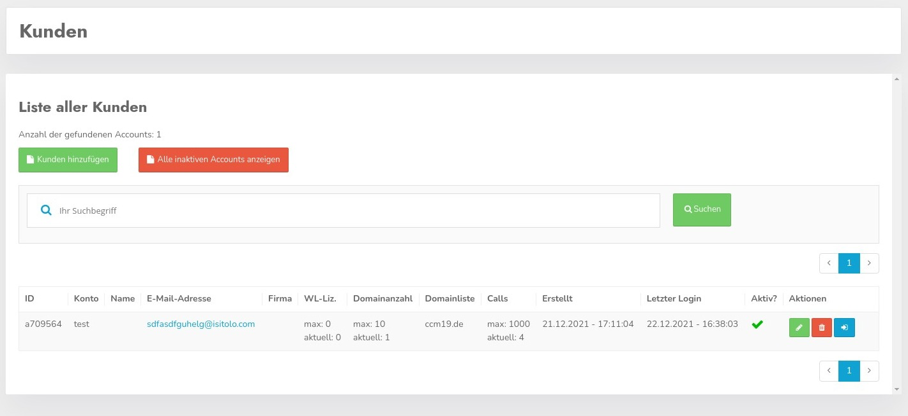
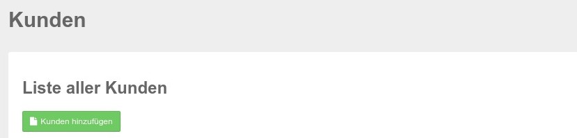
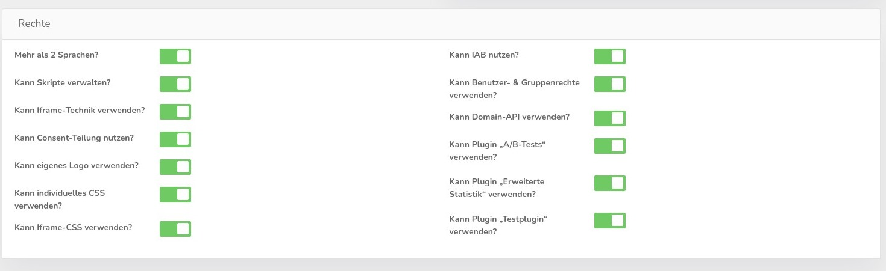
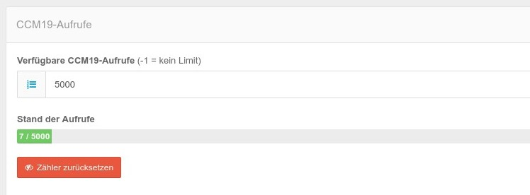

# Customers

Within CCM19 Enterprise / Agency version you can manage your own customers. Each customer can log in with his own user data and manage his own domains in his account.

Here you can see the overview of customers in your database. There can be any number of them. Clicking the green button will take you to the next screen.

## Create new customer / Edit customer

By clicking on the green button Create new customer you will jump to the appropriate mask.

## Create customer mask

Here you can set the important basic data for new customers. You can use this mask if you do not process the customers in your installation with the help of the API.

## Mandatory fields for new customer

The fields 

* Username, 
* Password 
* and e-mail address 

are mandatory fields that must always be set. The rest of the fields are for statistical purposes and to make users feel more secure.

### Enable

The "Active" checkbox activates or deactivates a customer.

### Whitelabel licenses

Here you can define how many WL licenses the respective user has available in his account. The customers can then freely distribute these to their domains. Whitelabel means here - your customers can remove the link to the manufacturer in the frontend widget.

### Available CCM19 calls

Here you set how many calls should be available to the customers. -1 means there is no limit. You can also decide freely. The number of calls is distributed over the domains.

### Max number of domains

Set how many domains customers have available in their accounts. Here, too, -1 = no limit.

### Automatic domain creation

This is a somewhat tricky automatism. It allows clients to embed a code into the page without individual domain detection. I.e. the link that is included **does not** contain the domainid=1234 parameter.

Domains are also created automatically. That means you include the code and when CCM19 detects the code is running under a domain the system doesn't know yet, an entry is created in the database and it appears in the domain listing in the backend. Here the entries can be administered then over it 

**But there are often nonsensical bycatch if e.g. domains like Google embed the page as iframe or visit the page via proxies

&gt; Here you should keep a close eye on what is happening.

## Rights

Here you can set which rights the customer should have in each case. Here detailed settings can be made what customers have access to and what not 

By default, new customers are created so that they have access to everything, so you only need to set something if it **should not** be so.

Also the access to the plugins can be changed here apart from the plugin own rules again. The following applies then:

1. Plugin is unlocked for all
2. User has no access to the plugin according to user settings because the hook is not set.

The user settings overwrite the plugin settings, which are only valid if access is available.

## Edit customers

If you edit a customer record you will see some additional information in the calls section.

The actual number of views is shown here and a button to reset the counter for the current month.

## Overview of existing customers

You can find a list of your customers if you click on the menu item Customers in the left menu.

The listing lists the basic data of your customers, how many accesses and domains were allowed and used.

You also see an overview of the domains that the customer uses. In the overview you can see a test customer whose domains we have copied again and again for display purposes.

In addition, you can see when the customer has logged in the last time and whether the customer is active at all.

### Edit

Click on the green button with the pencil icon to jump to the edit screen - this is the same as the screen for creating new users above.

### Delete customer

With the red trash can button you can delete a customer completely (after asking).

### Log in to customer account

With the blue button you can log in to the respective customer account without a password. Please note, however, that you always have to ask your customer for permission to do this 

## Search customers

With the help of the search mask you can look for certain customers, the search function searches all data records of the customers and lists only those which are found.

