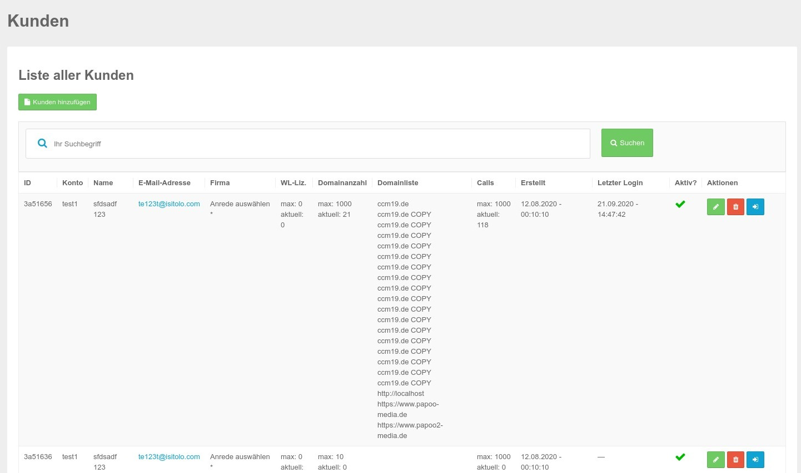
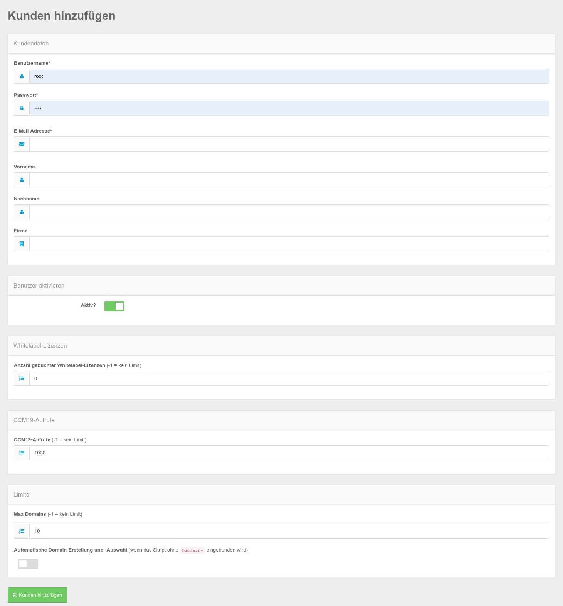

# Kunden

Innerhalb von der CCM19 Agency Version können Sie eigene Kunden verwalten. Jeder Kunde kann sich mit eigenen Benutzerdaten einloggen und seine eigenen Domains in seinem Account verwalten.

Eine Auflistung Ihrer Kunden finden Sie wenn Sie auf den Menüpunkte Kunden links im Menü klicken.

In dieser Maske stehen Ihnen folgende Funktionen zur Verfügung.

## Neuen Kunden erstellen

Mit Klick auf den grünen Button neuen Kunden erstellen springen Sie in die passende Maske hinein.

Hier können Sie die wichtigen Basisdaten für neue Kunden einstellen.

### Pflichtfelder für neuen Kunden

Die Felder Username, Passwort und E-Mail Adresse sind Pflichtfelder die immer gesetzt werden müssen. Die restlichen Felder dienen eher statistischen Zwecken und damit User sich darin etwas sicherer fühlen.

### Aktivieren

Der Haken "aktiv" setzt einen Kunden aktiv oder deaktiviert ihn.

### Whitelabel Lizenzen

Hier können Sie definieren wieviele WL Lizenzen der jeweilige User in seinem Account zur Verfügung hat. Diese können die Kunden dann frei auf Ihre Domains verteilen. Whitelabel bedeutet hier - sie können den Link zum Hersteller im Frontend Widget entfernen.

### CCM19 Aufrufe

Hier stellen Sie ein wieviel Aufrufe den Kunden jeweils zur Verfügung stehen sollen. -1 bedeutet es gibt kein Limit. Sie können darüber also ebenfalls frei entscheiden.

### Max Anzahl Domains

Stellen Sie ein wieviele Domains Kunden in Ihren Accounts zur Verfügung haben. Auch hier gilt -1 = kein Limit.

### Automatische Domain Erstellung

Das ist ein etwas heikler Automatismus. Damit können die Kunden einen Code in die Seite einbinden ohne individuelle Domainerkennung. Domains werden damit auch automatisch erstellt und können darüber verwaltet werden. Hier gibt es aber oft unsinnigen Beifang wenn z.B. Domains wie Google die Seite als iframe einbinden oder über Proxys die Seite besuchen.

Hier sollten Sie das also gut im Auge behalten was passiert.

