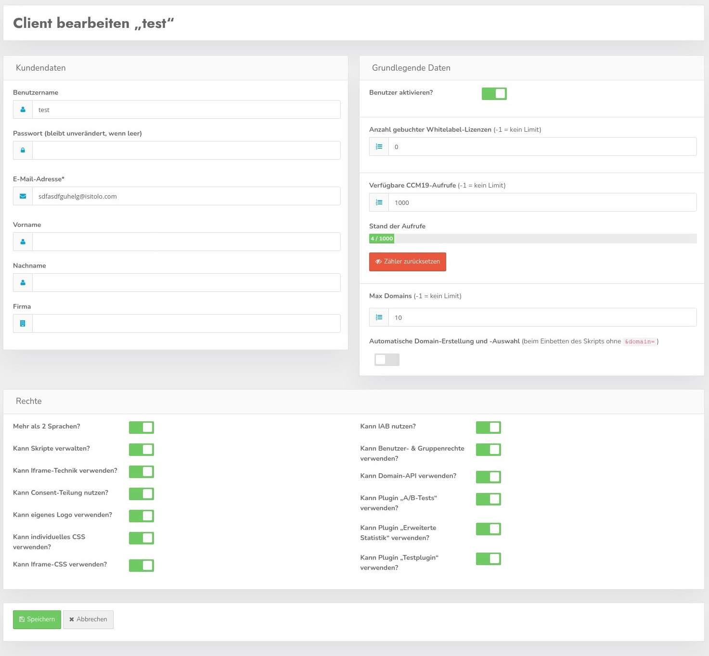

# Kunden

Innerhalb von der CCM19 Enterprise / Agency Version können Sie eigene Kunden verwalten. Jeder Kunde kann sich mit eigenen Benutzerdaten einloggen und seine eigenen Domains in seinem Account verwalten.

Hier sehen Sie die Übersicht der Kunden in der Ihrer Datenbank. Das können beliebig viele sein. Der Klick auf den grünen Button führt zu nächsten Maske.

## Neuen Kunden erstellen / Kunden bearbeiten

Mit Klick auf den grünen Button neuen Kunden erstellen springen Sie in die passende Maske hinein.

## Kunden erstellen Maske

Hier können Sie die wichtigen Basisdaten für neue Kunden einstellen. Diese Maske können Sie nutzen wenn Sie die Kunden in Ihrer Installation nicht mit Hilfe der API verarbeiten.

## Pflichtfelder für neuen Kunden

Die Felder 

* Username, 
* Passwort 
* und E-Mail Adresse 

sind Pflichtfelder die immer gesetzt werden müssen. Die restlichen Felder dienen eher statistischen Zwecken und damit User sich darin etwas sicherer fühlen.

### Aktivieren

Der Haken "aktiv" setzt einen Kunden aktiv oder deaktiviert ihn.

### Whitelabel Lizenzen

Hier können Sie definieren wieviele WL Lizenzen der jeweilige User in seinem Account zur Verfügung hat. Diese können die Kunden dann frei auf Ihre Domains verteilen. Whitelabel bedeutet hier - Ihre kunden können den Link zum Hersteller im Frontend Widget entfernen.

### Verfügbare CCM19 Aufrufe

Hier stellen Sie ein wieviel Aufrufe den Kunden jeweils zur Verfügung stehen sollen. -1 bedeutet es gibt kein Limit. Sie können darüber also ebenfalls frei entscheiden. Die Anzahl der Aufrufe wird dabei über die Domains verteilt.

### Max Anzahl Domains

Stellen Sie ein wieviele Domains Kunden in Ihren Accounts zur Verfügung haben. Auch hier gilt -1 = kein Limit.

### Automatische Domain Erstellung

Das ist ein etwas heikler Automatismus. Damit können die Kunden einen Code in die Seite einbinden ohne individuelle Domainerkennung. D.h. der Link der eingebunden wird enthält **nicht** den Parameter domainid=1234.

Domains werden damit auch automatisch erstellt. Das heißt Sie binden den Code ein und wenn CCM19 erkennt der Code läuft unter einer Domain die das System noch nicht kennt wird ein Eintrag in der Datenbank erstellt und er erscheint im Domainlisting im Backend. Hier können die Einträge dann darüber verwaltet werden. 

**Hier gibt es aber oft unsinnigen Beifang wenn z.B. Domains wie Google die Seite als iframe einbinden oder über Proxys die Seite besuchen.**

> Hier sollten Sie das also gut im Auge behalten was passiert.

## Rechte

Hier können Sie einstellen welche Rechte der Kunde jeweils haben soll. Hier können detaillierte Einstellungen durchgeführt werden worauf Kunden Zugriff haben und worauf nicht. 

Standardmäßig werden Neukunden so angelegt dass sie Zugriff auf alles haben, es muss also nur dann etwas eingestellt werden wenn es **nicht** so sein soll.

Auch der Zugriff auf die Plugins kann hier abseits der Plugin eigenen Regeln nochmal geändert werden. Es gilt dann folgendes:

1. Plugin ist für alle freigeschaltet
2. User hat keinen Zugriff auf das Plugin laut Usereinstellungen weil der Haken nicht gesetzt ist.

Die Usereinstellungen überschreiben damit die Plugineinstellungen, die also nur dann gelten wenn Zugriff vorhanden ist.

## Kunden bearbeiten

Wenn Sie einen Kundendatensatz bearbeiten sehen Sie noch einige zusätzliche Informationen im Bereich Aufrufe.

Es wird hier die tatsächliche Anzahl der Aufrufe angezeigt und ein Button um den Zähler für den aktuellen Monat zurückzusetzen.

## Übersicht über vorhandene Kunden

Eine Auflistung Ihrer Kunden finden Sie wenn Sie auf den Menüpunkte Kunden links im Menü klicken.

In der Auflistung werden die Basisdaten Ihrer Kunden aufgelistet, wieviel Zugriffe und Domains erlaubt und genutzt wurden.

Außerdem sehen Sie eine Übersicht über die Domains die der Kunden nutzt. In der Übersicht sehen Sie einen Testkunden dessen Domains wir zu Darstellungszwecken immer wieder kopiert haben.

Außerdem wird angezeigt, wann der Kunde sich das letzte mal eingeloggt hat und ob der Kunde überhaupt aktiv ist.

### Bearbeiten

Klicken Sie auf den grünen Button mit dem Stiftsymbol um in die Bearbeitungsmaske zu springen - diese ist die gleiche wie die oben stehende Maske zur Erstellung neuer Benutzer.

### Kunden löschen

Mit dem roten Papierkorb Button können Sie einen Kunden (nach Nachfrage) restlos löschen.

### In Kundenaccount einloggen

Mit dem blauen Button können Sie sich ohne Passwort in den jeweiligen Kundenaccount einloggen. Beachten Sie aber bitte dass Sie sich dafür immer die Freigabe von Ihrem Kunden geben lassen. 

## Kunden suchen

Mit Hilfe der Suchmaske können Sie nach bestimmten Kunden suchen, die Suchfunktion durchsucht alle Datensätze der Kunden und listet nur die auf die gefunden werden.

