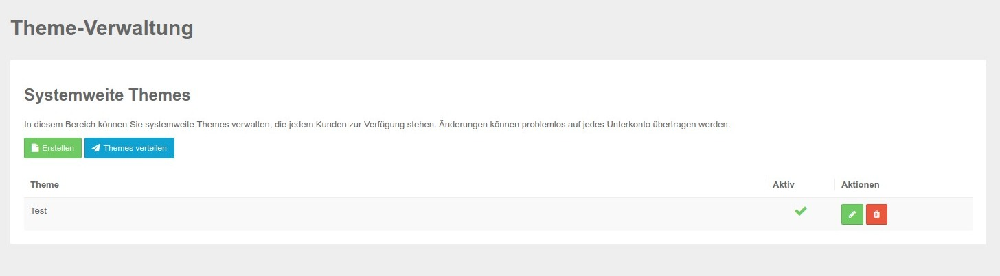

# Themes

Under the menu item Themes you can create new system-wide themes and play them out for all customers. After that, these themes are available in all customer accounts.

Create or edit the desired theme and then distribute it to all your users using the blue "Distribute Theme" button.

 

The edit screen is the same as available in the accounts under Themes, further explanation can be found here: [edit themes](../functions/themes.md) 

### Create theme

Clicking on the button leads to the following mask.

.jpg)

Here you can set all relevant settings regarding the themes. The details of the individual areas are explained in the Theme section in the Cookie &amp; Co, Administration.

### Distribute themes

Clicking this button will distribute the theme or changes in existing themes to all domains 

**Please note that these changes will be live immediately