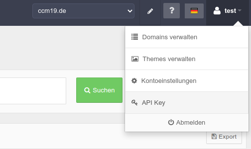

# API Key für General Api

Den Api Key für die domainspezifische General / Domain Api finden Sie rechts oben unter dem Menü -> ApiKey.

Wenn Sie darauf klicken landen Sie im folgenden Bereich.

## API Key 

Der Api Key selber finden Sie in der unten stehenden Maske. Mit dem Button 

