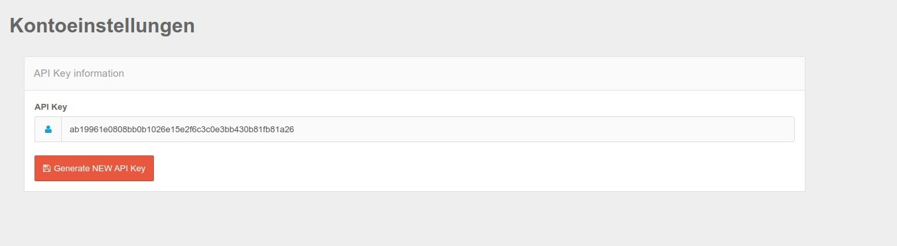

# API Key for General Api

The Api Key for the domain-specific General / Domain Api can be found in the Domain ApiKey menu.

## API Key 

The Api Key itself can be found in the mask below. With the button "Create new Api Key" the key is set and appears directly in the mask.

Please note that in this step, existing queries may no longer work because the old key is no longer valid.

## Use API Key

How to use the key and what for can be found here: [general_api usage](general_api.md) 