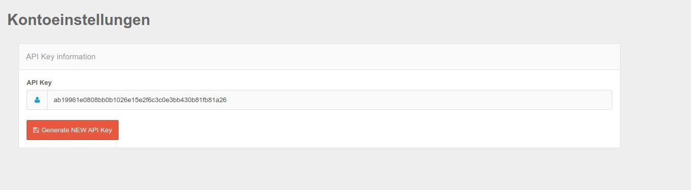

# Domain API / General API

With the domain specific API you can integrate Consent and Event data per domain and via a secured SSL interface into other systems.

## API Key 

The Api Key itself can be found in the mask below. With the button "Create new Api Key" the key is set and appears directly in the mask.

Please note that in this step, existing queries may no longer work because the old key is no longer valid.




The call is generally made with your Api Key as GET parameter `apiKey` - without it the call is not successful. Each key is only valid for one account.

The call is generally made by a simple GET call in the browser, curl or any other way to call web data.

## Test API

You can make a test call. Use the following API endpoint for this:

``url
GET /api/test
```

The system should respond as follows.

``json
{
    "username": "your_username",
    "apiKey": "YOUR_API_KEY"
}
```

## List all domains of the account

To list all domains of your account, please use the following API endpoint.

url
GET /api/domains
```

The response should be as follows:

``json
[
    {
        }, "id": "b61cd4a",
        "}, "name": ``http:\/\/www.test-xy.de'',
        }, "whiteLabel": false,
        "viewCount": 0
    },
    {
        }, "id": "1ed845d",
        }, "name": "test-12.com",
        "whiteLabel": false,
        "viewCount": 0
    }
]
```

The domId is the most important information - you can use it to get more information about the domain.

## Get all consents from the log

Use the following API endpoint to fetch all consents from the current log data block. Already archived log entries will not be taken into account. Please replace `{domainId}` in the url with a domain ID from the above query.

``url
GET /api/domains/{domainId}/consents
```

The response is as follows:

``json
[
    {
        "consent": true,
        "ucid": "387f1d311b2e7ba1f67722ac08bfdaf56aad3ecab6f11309d0c829f4e255af12",
        }, "timestamp": 1608208345,
        "purposes": {
            "41ba25c": "technically necessary"
        },
        "embeddings": {
            "16bd7f0": "Papoo CMS Session Management"
        },
        "manipulationPrevention": true
    },
    {
        "consent": true,
        "ucid": "387f1d311b2e7ba1f67722ac08bfdaf56aad3ecab6f11309d0c829f4e255af12",
        }, "timestamp": 1608208338,
        "purposes": {
            "41ba25c": "technically necessary"
        },
        "embeddings": {
            "16bd7f0": "Papoo CMS Session Management"
        },
        "manipulationPrevention": true
    },
    {
        "consent": true,
        "ucid": "cba4803da92a9b39ffa82cc93aecbe00bc3f695530ebd3f7e67326404073bdbd",
        }, "timestamp": 1608131136,
        "purposes": {
            "41ba25c": "technically necessary"
        },
        "embeddings": {
            "16bd7f0": "Papoo CMS Session Management"
        },
        "manipulationPrevention": true
    }
]
```

The consents are listed as follows:

* consent: true / false - a consent was given
* ucid: an individual Consent ID of a visitor
* timestamp: timestamp of the consent
* purposes: which category the consent belongs to
* embeddings: which embeddings resp. cookies the visitor has agreed to
* manipulationPrevention: true / false - whether manipulation attempts were prevented - i.e. not that there were any, but only that the suppression mechanism was active.

With the help of ucId you can then get an entry.


## Find an entry and read out data

This API endpoint can be used to filter log entries by Consent ID. Either this has to be specified completely or a substring starting from the beginning of the Consent-ID. So in the following example the entries can also be filtered with the value `387f1` for the parameter `{consentId}`.

The only important thing is that there is only one Consent-ID starting with `387f1`. **In case of collisions the request returns an empty list.**

``url
GET /api/domains/{domainId}/consents/{consentId}
```

This call then shows the entire consent history of this key - in the example

``json

[
    {
        }, "consent": true,
        "ucid": "387f1d311b2e7ba1f67722ac08bfdaf56aad3ecab6f11309d0c829f4e255af12",
        }, "timestamp": 1608208345,
        "purposes": {
            "41ba25c": "technically necessary"
        },
        "embeddings": {
            "16bd7f0": "Papoo CMS Session Management"
        },
        "manipulationPrevention": true
    },
    {
        "consent": true,
        "ucid": "387f1d311b2e7ba1f67722ac08bfdaf56aad3ecab6f11309d0c829f4e255af12",
        }, "timestamp": 1608208338,
        "purposes": {
            "41ba25c": "technically necessary"
        },
        "embeddings": {
            "16bd7f0": "Papoo CMS Session Management"
        },
        "manipulationPrevention": true
    }
]
```

You see, the ucid is identical in each case and the consents have different timestamps.