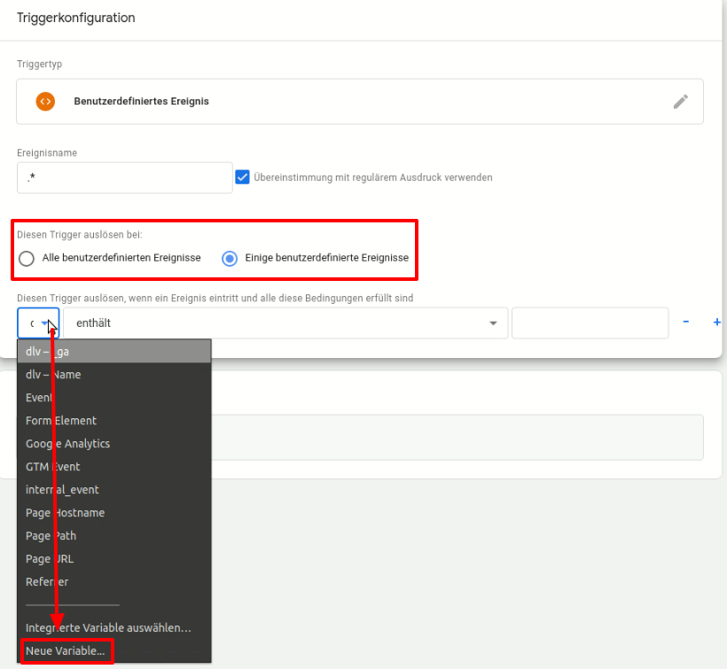

# Google Tag Manager

Since the Tag Manager acts as a container through which scripts can be included in the website, the scripts do not appear directly in the source code. Accordingly, it is never possible to remove the scripts from the page and re-integrate them at the cookie.

To block scripts that are loaded via the Tag Manager, ideally only the "Block embeddings that contain the following text" feature is used. However, for the blocking of the scripts to work, it must be ensured that the CCM19 code precedes the tag manager code in the source code.

First of all, we would like to point out that we do not recommend the use of the Google Tag Manager, because in most cases a cookie must be set for it to work, which is technically not really necessary, but must be defined as such.

In addition, from the point of view of the Schrems II ruling regarding Privacy Shield, the unsolicited integration of Google services is at least questionable and should be well considered.

In order to be able to guarantee the functionality of the tag manager and all associated services, the tag manager must always be active. Thus, it always sends at least the IP address of the user to the server of the tag manager and thus also to Google.

CCM19 is an alternative for the core function of the Google Tag Manager, to implement scripts on the website without having to edit the source code.

If this is still not an option for you, please follow these instructions:

## Integration with Google Tag Manager

Via the interface `window.dataLayer` events are triggered in the Google Tag Manager, if it is integrated on the target page.

As soon as an embedding is allowed via the CCM19 interface, the following event is triggered. The events are fired repeatedly on every page load for all allowed embeddings.

``javascript
window.dataLayer.push({
    event: 'CCM19.embeddingAccepted', // constant identifier
    id: 'xxxxxxx', // CCM19 internal embedding ID
    name: 'Google Analytics', // custom embedding name
});
```

In Tag Manager, this can be acted upon via Triggers → New → Custom Events.

.png)

This is what the information contained in the Data Layer looks like. Our goal is to set the triggers on this information.

Our starting point begins after the successful implementation of CCM19 and the Tag Manager on your website.

### 1. the entry in CCM19 for the Google Tag Manager

In CCM19, navigate from the Dashboard &amp; Inclusions to the Inclusions &amp; Cookies. Create an entry for Google Tag Manager there. How to create an entry and what to look out for can be found [here](https://docs.ccm19.de/funktionen/cookies-und-andere/). Make sure to set the Tag Manager as **technically necessary**.

### 2. set up tag

For our example, we created a tag for the Google Analytics web analytics tool. We left the tracking type set to pageview.

.png)

### 3. select trigger

As trigger type [a)] we set a custom event and name it *.\** [b)]. Check the *Use regular expression match* option [c)].

.png)

### 4.Create variables

Now, since the event is the same for each embedding, we still want to define with variables that the tag is fired only when the Google Analytics embedding is consented.
So we click on *Fire this trigger on: Some custom events* and add a new variable.




As variable type we select the data layer variable [a)]. As name we enter the key *name* [b)] and change to version 1 [c)].

.png)

### 5. add variable filter

Now we define what value the key *name* must have in order to fire the trigger. Here we **always** enter the name of the embedding (as it was stored in CCM19), so in this case *Google Analytics* [a)].

We also add an event [b)].


.png)

The event we enter here is *CCM19.embeddingAccepted*..png)

### 6. test, test, test...

The Tag Manager offers a preview mode for testing. So before going live with the version, you should check if the tags are fired.
In the messages, look for the appropriate embedding and take a closer look at the tag. If all checkmarks have been set there, the tracking works.

.jpg)

# More events

### CCM19.consentStateChanged

&gt; after version 2020.11.26

This event is fired every time the page visitor saves the consent configuration. After the initial consent is given, it is also sent on subsequent page loads.

It provides information about the permissions that the page visitor last configured.

Example:

``javascript
window.dataLayer.push({
    event: 'CCM19.consentStateChanged',
    initialConsent: true,
    'ccm19_Google Ads Conversion': true,
    'ccm19_Facebook Pixel': true,
    'ccm19_YouTube Webplayer': true,
});
```

- **event**: *string* - event identifier
- **initialConsent**: *boolean* - If initial configuration of page visitor is `true`, otherwise `false`.
- **ccm19_{EMBEDDING_NAME}**: *boolean* - If embedding agreed to by page visitor, `true`, otherwise `false`.

### CCM19.embeddingAccepted

This event will be fired on each page load and confirmation of the Consent dialog for each embedding that the page visitor has agreed to by his last configuration.

Example:

``javascript
window.dataLayer.push({
    event: 'CCM19.embeddingAccepted',
    id: 'xxxxxxx',
    name: 'CMS Session'
});
```

- **event**: *string* - event identifier
- **id**: *string* - CCM19 internal embedding ID
- **name**: *string* - Custom embedding name

## Cookie based (deprecated)

&gt; **deprecated:** Please do not use for new projects; change old code to embedding events.

Via the DataLayer, a "Custom Event" is fired in Google Tag Manager for each cookie that is allowed:

```
CCM19.cookieAccepted.<cookiename>
```

So for example `CCM19.cookieAccepted._ga` for the cookie **_ga**.</cookiename>