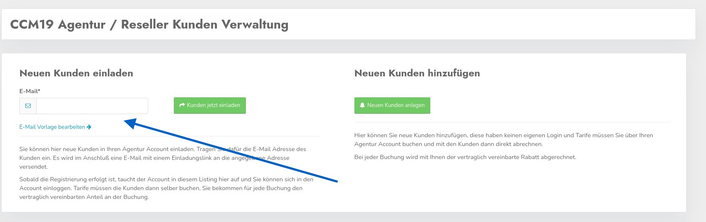

# Cloud Plus Agency Tarif

Den Cloud+ Agentur Tarif können Sie auf der Webseite hier buchen: 

https://www.ccm19.de/ccm19-preise-reseller.html

In diesem Tarif können Sie selber Kunden einladen und Kunden verwalten, Tarife buchen und vieles mehr. Den Ablauf für die beiden verschiedenen Wege haben wir hier einmal skizziert.

Um den Tarif zu buchen klicken Sie auf den entsprechenden Button in der Preisübersicht.

Klicken Sie sich nun durch den Warenkorb und den Checkout Prozess.

Als Bezahlmethoden stehen Ihnen hier nur gegen Rechnung oder Lastschrift zur Verfügung weil sich die Zahlungen je nach Verwendung des Accouns immer wieder erweitern, das ist mit anderen Zahlmethoden oft nur schwierig zu händeln, daher bieten wir das derzeit nur so an.

 Am Ende des Checkouts müssen Sie um die Affiliateprovision zu bekommen sich noch dafür anmelden.

Klicken Sie auf den Link und tragen Sie auf der folgenden Seite noch Ihre Kontoverbindungsdaten ein wohin die offenen Beträge überwiesen werden sollen.

## Affiliate Weg / Kunden einladen

Kunden die auf diesem Weg einen Account bekommen können sich selber in die CCM19 Maske einloggen, sie bekommen einen sogenannten LogIn Account.

Kunden die so eingerichtet wurden, werden Ihnen mit 40% Affiliate Provision verrechnet, die Abrechnung über die Affiliate Provision erfolgt jedes Quartal entsprechend des Affiliate Vertrages.

Um dies Kunden zu erstellen, verschicken Sie einen Einladungslink. Tragen Sie dafür die E-Mail Adresse des Kunden dort in die Maske ein. 

Den Text der Mail können Sie unter dem obigen Links "E-Mail Vorlage bearbeiten" ändern.

Wichtig ist dabei dass der Eintrag **#inviteLink#** erhalten bleibt, da dort der Link mit erzeugt wird mit der potentielle Kunden Ihnen zugewiesen wird. Ohne diesen Link klappt das nicht.

