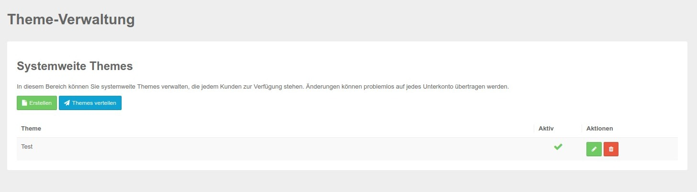

# Themes

Unter dem Menüpunkt Themes können Sie systemweite neue Themes erstellen und für alle Kunden auspielen. Danach stehen diese Themes in allen Kunden Accounts zur Verfügung.

Erstellen bzw. bearbeiten Sie das gewünschte Theme und spielen Sie es anschließen per blauen Button "Theme verteilen" an alle Ihre Benutzer aus.

 

Die Bearbeitungsmaske ist die gleiche wie Sie in den Accounts unter Themes zur Verfügung steht, weitere Erläuterungen dazu finden Sie hier: [Themes bearbeiten](../funktionen/themes.md) 