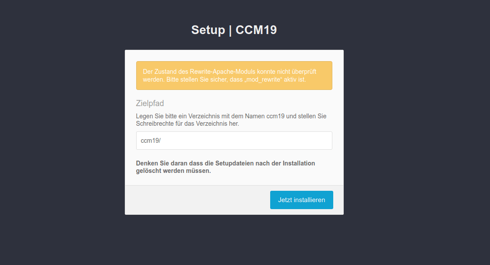
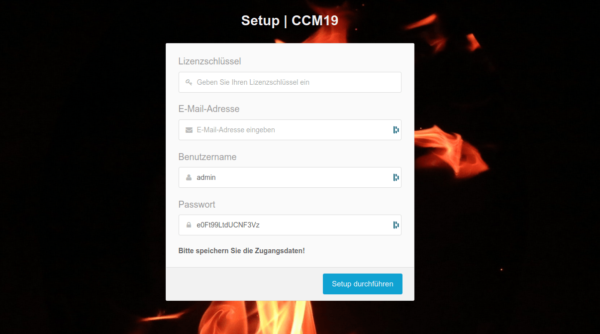

# Installation der CCM19 Downloadversion

Wenn Sie einen Fullservice Tarif nutzen und keine Downloadversion heruntergeladen haben - Sie sich also über die ccm19.de Seite einloggen - dann können Sie diesen Schritt hier überspringen.

## Installationsdatei herunterladen

Die Installationsdatei finden Sie im Downloadbereich von CCM19.de - nach dem Kauf der Version bekommen Sie eine E-Mail wo genau steht wo Sie die Dateien finden. Die Maske sieht dabei folgendermaßen aus.

## Dateien entpacken und hochladen

Nach dem Download der Dateien erhalten Sie eine .zip Datei. Diese Datei müssen Sie auf Ihrem PC entpacken. Wir empfehlen hierfür das hauseigene Programm von Windows oder das kostenfrei verfügbare Programm [7Zip](https://www.7-zip.org/). Auf Ihrem Rechner werden nun zwei neue Datein abgelegt. *setup.php* und *ccm19.zip*.

## Schritt 2 - Dateien per FTP auf Ihren Server hochladen

Nach dem Entpacken müssen Sie Ihre Dateien auf den FTP-Server spielen. Es empfiehlt sich, den Anweisungen des Hosters zu folgen. Sollte der Hoster keine Informationen zu Ihrem FTP-Server hinterlegt haben, fragen Sie diese bitte bei ihm an.

**Wir können Ihnen keine Fragen zu Ihrer FTP-Login-Daten** **beantworten, wir kennen diese NICHT.** Die Dateien *setup.php* und *ccm19.zip* laden Sie in das Stamm-Verzeichnis Ihrer Webseite (oder einen beliebig erstellten Ordner).

**Hinweis: CCM19 erstellt standardmäßig einen Unterordner /ccm19. Legen Sie also Ihre Datein entsprechend Ihrer Wünsche ab. Wenn Sie CCM19 in das aktuelle Verzeichnis statt einen Unterordner installieren möchten, tragen Sie bitte `./` bei Schritt 3 in die Maske für das Verzeichnis ein.**

## Beachten Sie die PHP Version!

Achtung! **Die verwendete PHP Version muss mindestens PHP 7.2.x lauten – oder höher.** Falls Sie auf Ihrer Seite die PHP-Version nicht ohne Weiteres updaten können, besteht die Alternative, dass Sie bei Ihrem Provider eine **(Sub-)Domain** einrichten und dort die **PHP Version auf 7.2 oder höher stellen**. *Sie können das CCM19 Skript dann auf dieser (Sub-)Domain installieren und von dort aus in Ihre eigentliche Seite einbinden.*

Falls auch das nicht funktioniert oder Ihnen der Aufwand zu hoch ist, steht Ihnen die [Service Variante](https://www.ccm19.de/ccm19-service-tarife.html) unseres Tools zur Verfügung – hier muss nichts installiert werden.

  

## Schritt 3 - Installation - Screen 1

Navigieren Sie auf Ihrer Webseite nun zu dem Ordner, in dem Sie die Dateien abgelegt haben und rufen darin die Datei *setup.php* auf. In unserem Beispiel wäre dies https://www.MeineDomain.de/setup.php, da wir die Dateien direkt im Stammverzeichnis abgelegt haben.
**Das CCM19-Tool wird in diesem Beispiel später über https://www.MeineDomain.de/ccm19/ erreichbar sein.**

In diesem Screen können Sie das Installationsverzeichnis ändern. Hier können Sie auch Ordner wie /cookies/, /kekse/ oder ähnliches, aber auch ./ für das aktuelle Verzeichnis angeben. Für unser Beispiel belassen wir es bei /ccm19/.

------

## Schritt 3.5 - Anpassungen der Serverkonfiguration

Sofern Sie **nginx** als Webserver verwenden, sind üblicherweise Anpassungen an der Serverkonfiguration nötig.

Bitte folgen Sie der Anleitung [**Einrichtung eines Nginx-Servers für CCM19**](https://www.ccm19.de/einrichtung-eines-nginx-servers-fuer-ccm19.html), bevor Sie fortfahren, falls Sie Nginx verwenden und die Setup-Maske zur Eingabe des Lizenzschlüssels nicht direkt nach dem ersten Installations-Screens erscheint.

## Schritt 4 - Lizenzschlüssel - Screen 2

Nach der kurzen Installation werden Sie auf die Registrierungsmaske weitergeleitet. Hier müssen Sie Ihren gekauften Lizenzschlüssel eingeben, den Sie [hier](https://www.ccm19.de/account.php?menuid=248&account_extuser=4) einsehen können.

Oder Sie navigieren auf der ccm19.de Seite im Top-Menu unter **Login** > **Download Version Login** und danach im **Sub-Menu** zum Punkt **Lizenzen**. Dort kopieren Sie Ihren Lizenzschlüssel und fügen ihn in die entsprechende Spalte ein.

Danach tragen Sie noch eine **gültige** E-Mail Adresse ein (ohne gültige E-Mail Adresse können Sie später Ihr Passwort nicht zurücksetzen!). Danach können Sie noch einen Usernamen und ein Passwort wählen. **Der Benutzername kann später NICHT mehr geändert werden!**

Klicken Sie danach auf "Setup durchführen" und das System wird installiert.

Mehr Informationen zur Einrichtung der einzelnen Punkte finden Sie [**hier**](https://www.ccm19.de/bedienung-und-einrichtung.html).