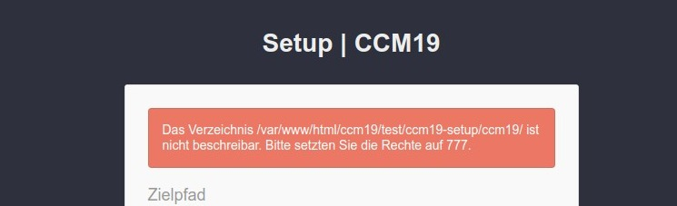
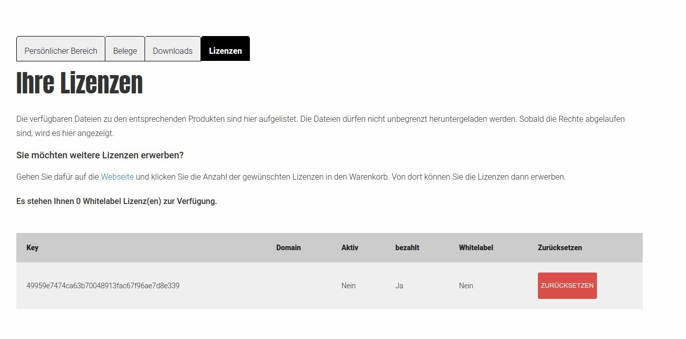

# Installation of the download version

You only need this part if you have downloaded a download version and want to install it. Most customers use our cloud version. For them this part is not relevant.

## Download installation file

You can find the installation file in the download area of [CCM19.de](https://www.ccm19.de/account/) - after purchasing the version you will get an email where it says exactly where you can find the files. The mask looks like this. Under the tab Licenses you will find the license key you need in step 2 of the installation. The keys can also be reset.

## Unzip and upload files

After downloading the files you will receive a .zip file. You have to unpack this file on your PC.  Now two new files will be stored on your computer. *setup.php* and *ccm19.zip*.

## Upload files via FTP to your server

After unpacking, you need to play your files to your server via FTP / SSH or other ways. It is recommended to follow the hoster's instructions. If the hoster has not stored information about your server, please ask them for it.

&gt; **We can not answer any questions about your FTP login information** **we do NOT know them.** 

Download the files *setup.php* and *ccm19.zip* into the root directory of your website (or a folder of your choice).

CCM19 creates a subfolder /ccm19 by default, so place your files as you wish. If you want to install CCM19 into the current directory instead of a subfolder, please enter `./` in the directory mask.

## Note PHP version

The PHP version used must be at least **PHP 7.2.x** - or higher (7.3.x, 7.4.x). If you cannot easily update the PHP version on your site, the alternative is to set up a (sub-)domain with your provider and set the PHP version there to 7.2 or higher 

You can then install the CCM19 script on this (sub-)domain and integrate it from there into your actual site.

If this does not work either or the effort is too high for you, the [Service Variant](https://www.ccm19.de/ccm19-service-tarife.html) of our tool is available - here nothing has to be installed.

  

## Installation - Step 1

Now navigate to the folder on your website where you have placed the files and call the file *setup.php* in it. In our example this would be https://www.MeineDomain.de/setup.php, as we have placed the files directly in the root directory.

## Change directory name

Optimally, change the directory name to something innocuous. Preferably a random combination of letters and numbers to catch the blockers that might otherwise block the script.

## Oops - an error 500 or another occurs?

You should make sure with 1&amp;1 or domainfactory that you set the RewriteBase after the installation. Here short an explanation how this works:

We assume in the following that you have put the CCM19 installation into the directory "cookies". If you put CCM19 in another directory you have to change it. In principle you have to change 2 .htaccess files.

1. call [mydomain.com/cookies/setup.php](http://meinedomain.de/cookies/setup.php) and follow instructions.
2. setup.php should redirect you to [mydomain.com/cookies/ccm19/public/setup](http://meinedomain.de/cookies/ccm19/public/setup) - **This is where the 500 occurs.**
3.  edit mydomain.com/cookies/ccm19/.htaccess - under the line "RewriteEngine On" enter:
   `RewriteBase /cookies/ccm19/`
4. edit mydomain.com/cookies/ccm19/public/.htaccess - also add here under "RewriteEngine On":
   `RewriteBase /cookies/ccm19/public/`

  Now try to call [mydomain.com/cookies/ccm19/public/setup](http://meinedomain.de/cookies/ccm19/public/setup).

&gt; If the 500 error persists, it may be a different problem. We would be happy to investigate the problem for you free of charge; all you need is temporary FTP access, which you can close again once the work is complete. Just write us via our [support form](https://www.ccm19.de/supportanfrage/).

**The CCM19 tool will be accessible later via https://www.MeineDomain.de/ccm19/ in this example

In this screen you can change the installation directory. Here you can also specify folders like /cookies/, /kekse/ or similar, but also ./ for the current directory. For our example we leave it at /ccm19/.

### Write permissions

Please make sure that you set the write permissions for the directory correctly so that the setup script can write the files into it, otherwise you will get the following error message.

## nginx? - Customize server configuration

If you use **nginx** as a web server, usually adjustments to the server configuration are necessary. If you use nginx - an adjustment of the server configuration is necessary. You can find more information about this in the technology section: [Technology](../api/technik.md) 

## Step 2 - Enter license key

After the short installation you will be redirected to the registration mask. Here you have to enter your purchased license key, which you can view [here](https://www.ccm19.de/account.php?menuid=248&amp;account_extuser=4).

Or you navigate on the ccm19.de page in the top menu under **Login** &gt; **Download Version Login** and then in the **Sub-Menu** to the item **Licenses**. There you copy your license key and paste it into the corresponding column.

Then enter a valid e-mail address (without a valid e-mail address you will not be able to reset your password later!) After that you can choose a username and a password. **The username can NOT be changed later!** After that click on "Perform setup" and the system will be installed.

Furthermore, you can specify a proxy server under "Advanced settings" if one is used in your company for the output of the website - but this is a very rare condition. Usually this is not done.

## Done

Once the installation script is ready, you will be redirected to the [login screen](login-and-passwords.md) or logged in directly and you will land in the dashboard.

## After the installation

After the installation you should delete the setup files so that the setup cannot be executed again - you will also get a corresponding note in the administration.

### Reset key

With the Reset button you can remove the key from the installation at any time and set it again. This makes sense, for example, if you first test the installation on a subdomain and then reinstall it later in the live system.