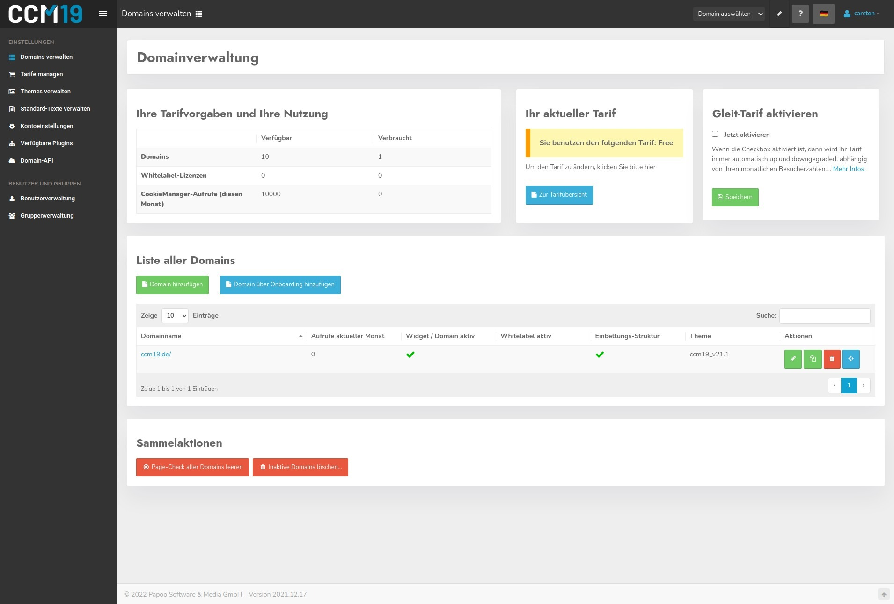

# CCM19 Login &amp; Passwords

When you start CCM19 - no matter with which version - you will see the login window first. Log in there with your account data. If you forgot your password, you can use the "forgot password" option 

In this window you will also get error messages in case something is wrong with the login, the license has expired or other problems.

## Wallpaper

The background image changes in irregular intervals.

## Password forgotten function with the download version

With the download version the sending of the data only works if you have entered a working email address in the administration of CCM19. If you are completely locked out and a reinstallation is not possible, please contact the [CCM19 Support](https://www.ccm19.de/supportanfrage/).  

## License no longer valid

If you have deactivated your license or it is no longer valid for other reasons, you will get a notice when you log in. You can reactivate or extend the license at any time. Normally the access will be extended automatically for the booked period, you don't have to do anything then. If it does not work at all, please contact our support.

## Successful login -&gt; Dashboard

After successful login you will land in the dashboard of CCM19 - here you have the overview of all relevant functions. On the left side you will find all menu items with all areas that are available to you.

In the next step you should start with the [onboarding](onboarding-step-1.md).

