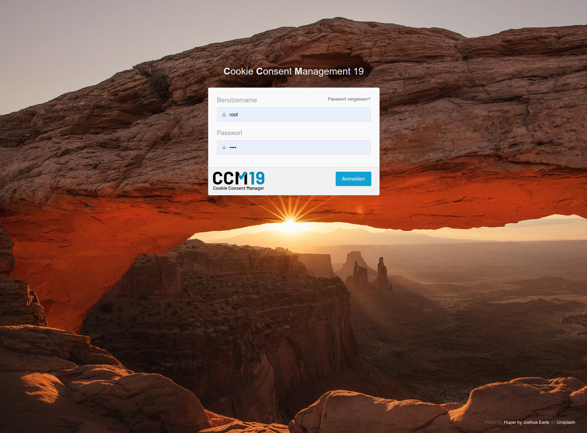

# Login & Passwörter

Wenn Sie das CCM19 aufrufen - egal mit welcher Version - sehen Sie als erstes das Loginfenster. Loggen Sie sich dort mit ihren Accountdaten ein. Falls Sie Ihr Passwort vergessen haben, können Sie die “Passwort vergessen” Option nutzen. 

## Passwort vergessen Funktion bei der Downloadversion

Bei der Downloadversion funktioniert das zusenden der Daten nur, wenn Sie eine funktionierende E-Mail Adresse  in der Administration von CCM19 eingetragen haben. Falls Sie sich komplett ausgesperrt haben und eine Neuinstallation nicht möglich ist, wenden Sie sich hier an den [CCM19 Support](https://www.ccm19.de/supportanfrage/).  

In diesem Fenster bekommen Sie auch Fehlermeldungen angezeigt falls etwas beim Login nicht mehr korrekt ist, die Lizenz abgelaufen ist oder andere Probleme bestehen.

## Lizenz nicht mehr gültig

Falls Sie Ihre Lizenz deaktiviert haben oder sie aus anderen Gründen nicht mehr gültig ist, bekommen Sie beim Login einen Hinweis angezeigt. Sie können die Lizenz jederzeit wieder aktivieren oder eine neue kaufen oder aktivieren. Falls es gar nicht klappt, wenden Sie sich bitte an unseren Support.

