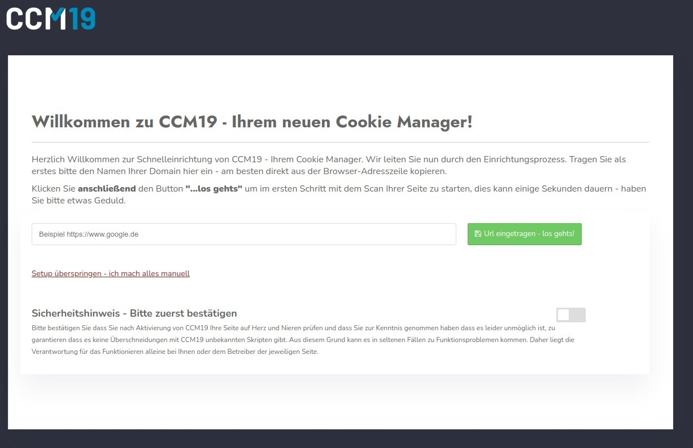
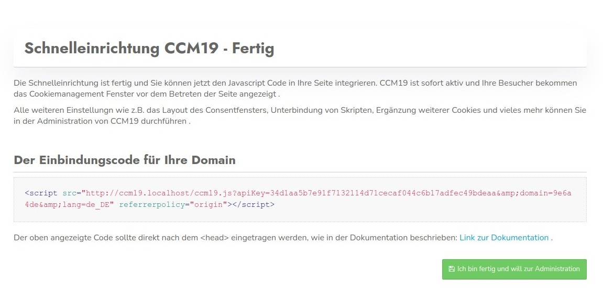

# Onboarding 
Directly after the 1st call in the administration you will be guided through the so-called onboarding. In this process, the most important points of your page are queried, scanned and processed. You can take corrective action at every step.

## Step 1

Everything that is created in Onboarding can later be adjusted and changed in Administration.

If onboarding does not start automatically, you can simply click the following link on the dashboard:


### Enter the domain.

After the first login the following screen will appear - here you can enter your domain and scan for cookies and scripts. It is important that you tick off the security note.



Of course you can also do everything manually, just click on the link "Setup skipped - I do everything manually" 

## Onboarding - Step 2

In this step you will see the results of the automatic scan of your site. Here you can take over and adjust the data. An entry is created for each provider or embedding found 

For each of these entries, the cookies and storage elements used are listed.

### Evaluate scan results

For each entry, you can add and adjust the legally required texts here 

A database from CCM19 runs in the background and is queried based on the cookies and storage elements used 

Furthermore, a screenshot of the page is created for your control that actually the correct page was scanned.


The results are divided into the 5 standard categories into which scripts, cookies and storage elements are usually assigned.

* Technically Necessary (Essential)
* Advertisements / Ads
* Analytics / Statistics
* Personalization
* Social Media
* Other

Behind each entry you can see how many entries were found in the respective category and could be sorted automatically.

Input fields are provided for all information that CCM19 considers necessary.

#### Name of the integration

The name of the integration - this can be e.g. Google Analytics or Facebook Pixel. Here you should use a meaningful name.

#### Purpose

Here again the categories already mentioned above appear. You can assign any entry to any category. Please note, however, that you must observe the legal framework. Facebook Pixel, for example, will hardly be correctly sorted under technically necessary.

#### Activate

Here you activate the entry, so that it can also be checked off in the frontend

#### Block scripts.

Here you can block scripts that are included in the source code of your page by CCM19. Use e.g. Google Analytics:

``javascript
<!-- Global site tag (gtag.js) - Google Analytics -->
<script async src="https://www.googletagmanager.com/gtag/js?id=UA-123456789-1"></script>
<script>
  window.dataLayer = window.dataLayer || [];
  function gtag(){dataLayer.push(arguments);}
  gtag('js', new Date());

  gtag('config', 'UA-123456789-2');
</script>
```

Then enter in the field e.g. "googletagmanager.com" - this will block any javascript on your page that contains these characters (string) and the script will not be executed unless consent is given.

This way you don't have to rebuild your page.

#### Provider

The provider - here you have to enter the company name of the provider offering the script. In our case it would be Google Ireland Limited. You can also enter the complete address of the company here.

#### Description 

In the description, enter the task of the integration. Why is it set? What does this embedding do?

#### Privacy link

This is the link to the provider's privacy policy. You can usually find this when you go to the provider's website.

#### What data is collected?

What data is collected exactly? Only the IP? Or also click data, browser data, logins, behavior, etc.? Find out exactly from the provider of the script and enter as precisely as possible what happens to the data. This is the only way to get informed consent from your visitors.

#### For what purpose is the data collected?

Why do you collect this data? What do you want to do with it? Conversion optimization? Improve user experience? Or just implement a shopping cart function? 

#### Legal basis

Here you define the legal basis on the basis of which you want to make this integration. For tracking scripts, usually only "consent, Art. 6 para. 1 lit. a DSGVO" applies - consent of the visitor by an informed decision. So purely voluntary.

#### Place of processing

Where the data is processed. This is not only the address of your office but also where is the server located? Please also consider that you are currently not allowed to transfer data to unsafe third countries. Providers who export data to the USA are currently legally probably not possible (as of 29.09.2020).

#### List of cookies and storage elements

Here is a list of all cookies and storage elements set by the script. You can add more elements manually, because the automatic scan cannot always find all data. E.g. the scanner cannot find data for a logged in state.

##### Name

The name in the browser - e.g. _ga for a Google Analytics cookie

##### dyn.

This determines whether it is a dynamic variable - e.g. _g* blocks all cookies that begin with _g, i.e. _ga, _gid, etc.

##### memory type

How the data is stored in your browser.

##### Lifetime / Expires

When does the memory entry expire automatically.

##### Value

What value does the cookie transport - usually it is cryptic data that is stored here.

### Accept data

When you have checked all the data and made necessary adjustments, click on the button below the form to transfer the data to CCM19 Administration - see screenshot.


.jpg)

## Onboarding - Step 3

In step 3 you enter the links to your imprint and your privacy policy. You can change this data later in the administration at any time.

Since the system knows the page and has scanned it in the previous step, it also tries to automatically read the links to the imprint and privacy policy and pre-populate them in the form as you can see in the next screenshot.


Please adjust the data if necessary, so that the correct links are in there. Then click on the green button to go to the next step.

## Onboarding - Step 4

Here you define the placeholder texts for your page - the most important ones are the ones you can see in the screenshot below:

* **{Company}** -&gt; Enter the name of your company here.
* **{Company_Privacy}** -&gt; Enter the link to your privacy policy here.
* **{Company_Location}** -&gt; Enter here the location of your company with zip code and city.

When you have entered the data, click on the green button below. Since the system knows the link to the imprint, it tries to read the necessary data from the page, please correct it if necessary.


## Onboarding - Step 5

On the last page of the onboarding you will find the embed code of the CCM19 for your website. You don't need to remember it here - it is always displayed in the administration dashboard as well. But of course you can copy it directly and embed it into your page.



### Embed code

The embed code may look like this.

`` html
<script src="http://localhost/ccm19/cookie-consent-management/www/public/ccm19.js?apiKey=1234&amp;domain=1234&amp;lang=de_DE" 
referrerpolicy="origin">
    </script>
```


### Example integration

Copy this code and paste it on your page as high as possible in the page header, preferably right after the first <head>element

``` html
<html>
 <head>
  <script src="http://CCM19ServerUrl/ccm19.js?apiKey=1234&domain=1234" 
          referrerpolicy="origin"></script>
 </head>
 <body>
 </body>
<html>   
```


## Ready and out

When you are done, click the blue button to jump back to CCM19 Administration.
</html></html></head> 