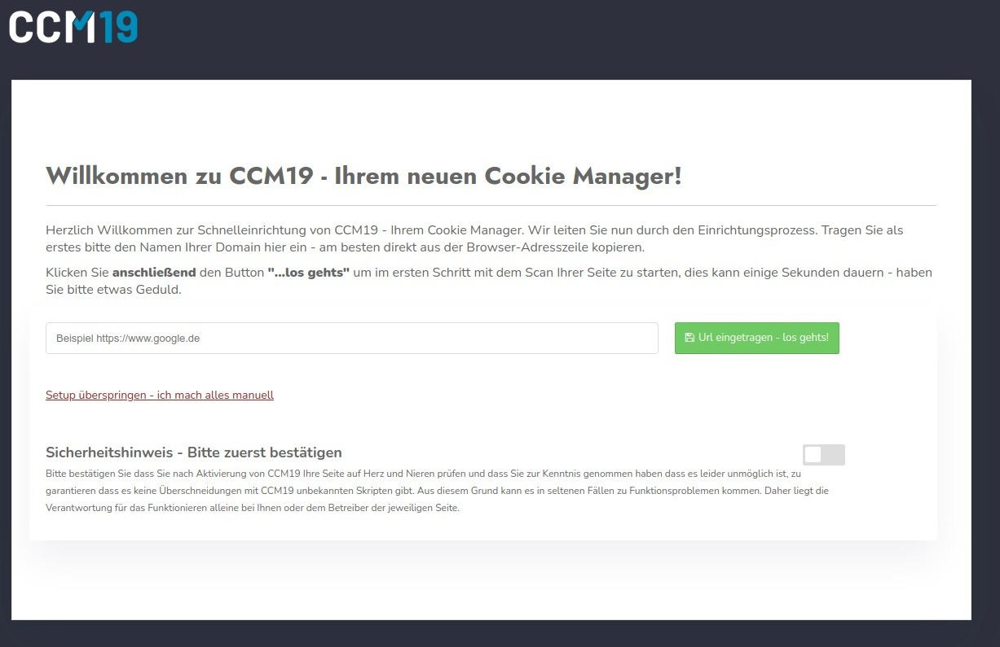

# Onboarding - Schritt 1

Direkt nach dem 1. Aufruf in der Administration werden Sie durch das sogenannte Onboarding geführt. In diesem Prozess werden die wichtigsten Punkte Ihrer Seite abgefragt, gescannt und verarbeitet. Sie können hier bei jedem Schritt korrigierend eingreifen.

Alles was im Onboarding erstellt wird können Sie später in der Administration wieder anpassen und ändern.

Falls das Onboarding nicht automatisch startet können Sie auf dem Dashboard einfach den folgenden Link klicken:

## Eingabe der Domain.

Nach dem ersten Login erscheint die folgende Maske -  hier können Sie Ihre Domain eintragen und nach Cookies und Skripten scannen lassen. Wichtig ist dass Sie den Sicherheitshinweis abhaken.

Natürlich können Sie auch alles manuell durchführen, klicken Sie dafür einfach auf den Link "Setup überspriungen - ich mache alles manuell". 

