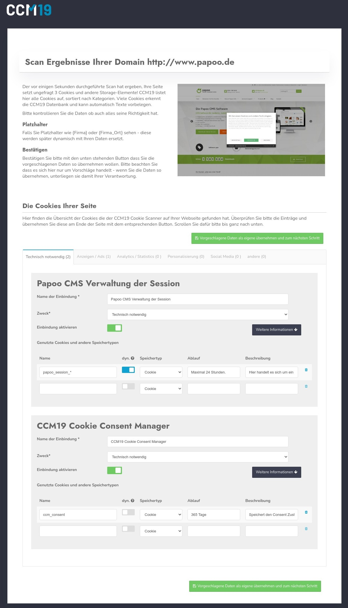

# Onboarding - Step 2

This step displays the results of the automatic scan of your site. Here you can take over and adjust the data. An entry is created for each provider or embedding found 

For each of these entries, the cookies and storage elements used are listed.

## Evaluate scan results

For each entry, you can add and adjust the legally required texts here 

In the background runs a database from CCM19 which is queried based on the cookies and storage elements used 

Furthermore, a screenshot of the page is created for your control that actually the correct page was scanned.



The results are divided into the 5 standard categories into which scripts, cookies and storage elements are usually assigned.

* Technically Necessary (Essential)
* Advertisements / Ads
* Analytics / Statistics
* Personalization
* Social Media
* Other

Behind each entry you can see how many entries were found in the respective category and could be sorted automatically.

Input fields are provided for all information that CCM19 considers necessary.

### Name of the integration

The name of the integration - this can be e.g. Google Analytics or Facebook Pixel. You should use a meaningful name here.

### Purpose

Here again the categories already mentioned above appear. You can assign any entry to any category. Please note, however, that you must observe the legal framework. Facebook Pixel, for example, will hardly be correctly sorted under technically necessary.

### Activate

Here you activate the entry so that it can also be checked off in the frontend

### Block scripts.

Here you can block scripts that are embedded in the source code of your page by CCM19. Use e.g. Google Analytics:

``javascript
<!-- Global site tag (gtag.js) - Google Analytics -->
<script async src="https://www.googletagmanager.com/gtag/js?id=UA-123456789-1"></script>
<script>
  window.dataLayer = window.dataLayer || [];
  function gtag(){dataLayer.push(arguments);}
  gtag('js', new Date());

  gtag('config', 'UA-123456789-2');
</script>
```

Then enter in the field e.g. "googletagmanager.com" - this will block any javascript on your page that contains these characters (string) and the script will not be executed unless consent is given.

This way you don't have to rebuild your page.

### Provider

The provider - here you need to enter the company name of the provider offering the script. In our case it would be Google Ireland Limited. You can also enter the complete address of the company here.

### Description 

In the description, enter the task of the integration. Why is it set? What does this integration do?

### Privacy link

This is where the link to the provider's privacy policy belongs. You can usually find this when you go to the provider's website.

### What data is collected?

What data is collected exactly? Only the IP? Or also click data, browser data, logins, behavior, etc.? Find out exactly from the provider of the script and enter as precisely as possible what happens to the data. This is the only way to get informed consent from your visitors.

### For what purpose is the data collected?

Why are you collecting this data? What do you want to do with it? Conversion optimization? Improve user experience? Or just implement a shopping cart function? 

### Legal basis

Here you define the legal basis on the basis of which you want to make this integration. In the case of tracking scripts, usually only "consent, Art. 6 para. 1 lit. a DSGVO" applies - consent of the visitor through an informed decision. So purely voluntary.

### Place of processing

Where the data is processed. Here is not only the address of your office but also where is the server located? Please also consider that you are currently not allowed to transfer data to unsafe third countries. Providers who export data to the USA are currently legally probably not possible (as of 29.09.2020).

### List of cookies and storage elements

All cookies and storage elements set by the script are listed here. You can add more elements manually, because the automatic scan cannot always find all data. For example, the scanner cannot find data for a logged in state.

#### Name

The name in the browser - e.g. _ga for a Google Analytics cookie

#### dyn.

This determines whether it is a dynamic variable - e.g. _g* blocks all cookies that start with _g, i.e. _ga, _gid, etc.

#### memory type

How the data is stored in your browser.

#### Lifetime / Expires

When does the memory entry expire automatically.

#### Value

What value does the cookie transport - usually it is cryptic data that is stored here.

## Accept data

When you have checked all data and made necessary adjustments, click on the button below the form to transfer the data to the CCM19 administration - see screenshot.


.jpg)