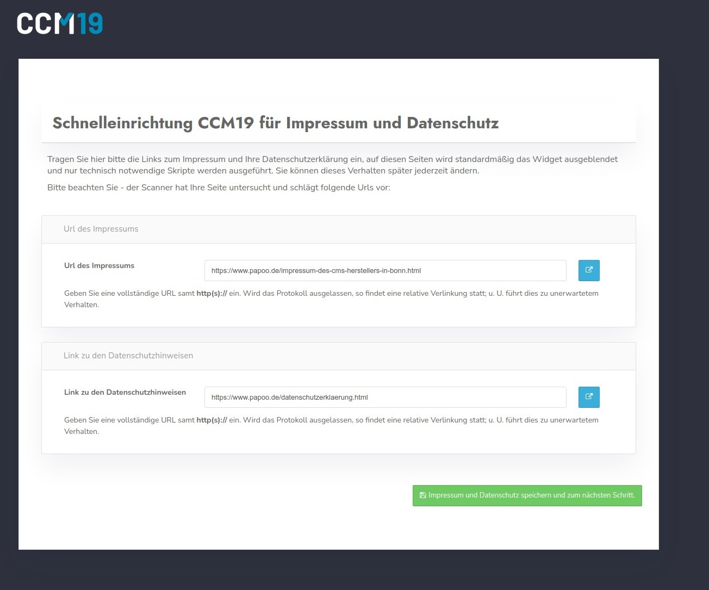

# Onboarding - Step 3

In step 3 you enter the links to your imprint and your privacy policy. You can change this data later in the administration at any time.

Since the system knows the page and has scanned it in the previous step, it also tries to automatically read the links to the imprint and privacy policy and pre-populate them in the form as you can see in the next screenshot.

Please adjust the data if necessary, so that the correct links are in there. Then click on the green button to go to the next step.

