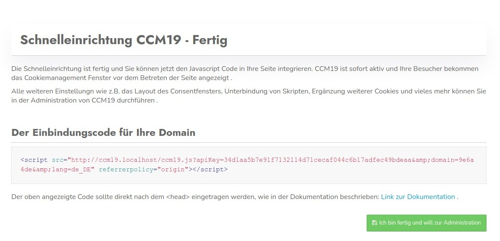

# Onboarding - Step 5

On the last page of the onboarding you will find the embed code of the CCM19 for your website. You don't have to remember it here - it will be displayed in the dashboard of the administration as well. But of course you can copy it directly and embed it into your page.



## embed code

For example, the embed code may look like this.

`` html
<script src="http://localhost/ccm19/cookie-consent-management/www/public/ccm19.js?apiKey=1234&amp;domain=1234&amp;lang=de_DE" 
referrerpolicy="origin">
    </script>
```


## Example integration

Copy this code and paste it on your page as high as possible in the header of the page, preferably right after the first <head>element

``` html
<html>
 <head>
  <script src="http://CCM19ServerUrl/ccm19.js?apiKey=1234&domain=1234" 
          referrerpolicy="origin"></script>
 </head>
 <body>
 </body>
<html>   
```


## Ready and out

When you are done, click the blue button to jump back to CCM19 Administration.
</html></html></head> 