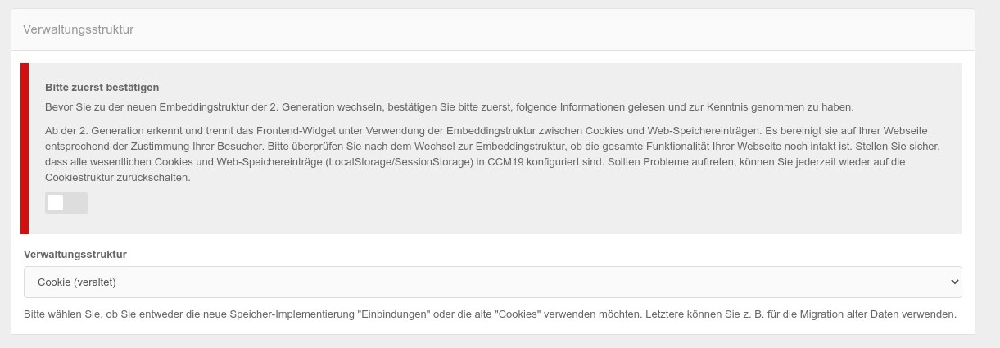
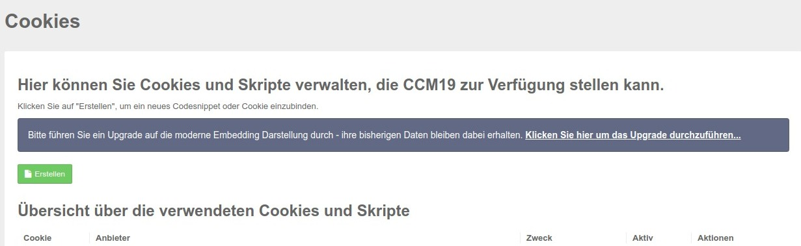
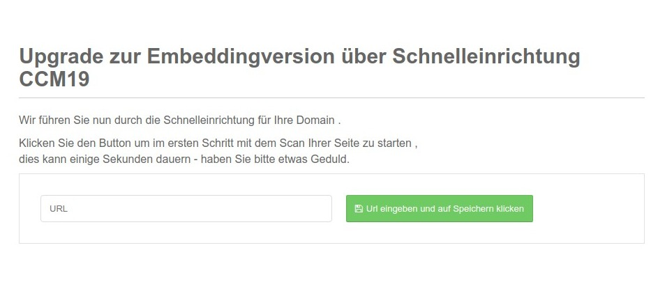

# CCM19 Upgrade to Generation 2

If you are using a version purchased after 10/13/2020 this does not affect you. For all others:

With the release of version 10/13/2020, the CCM19 Cookie Consent Tool has been rebuilt to display and process embeds instead of using "cookies only" 

&gt; The old Generation 1 variant will still be maintained at least until the end of 03.2021, but will generally no longer receive new features but only bug fixes.

In the old Consent mask you could only confirm or reject categories, with the new version you can now not only check off the categories, but also the individual bindings 

&gt; Google Analytics is a good example. Previously you had to enter each cookie separately, now it is enough to select an entry Google Analytics from the database and then all cookies and elements are directly created with. Visitors can then choose whether they want to use Google Analytics or not.

If you have been using an old version of Generation 1, you can manually upgrade to Generation 2. An automatic upgrade is unfortunately not possible, because we do not know all cookies and contexts.

&gt; But don't worry - the upgrade is actually quite simple to do and usually takes about 5 minutes

## Perform upgrade

There are 2 ways to perform the upgrade.

1. Conversion of the software by selection, then the entries must be created again manually
2. Upgrade by advanced onboarding - then almost everything can be done automatically.

### 1. conversion per selection

To perform the changeover manually, go to the menu item Frontend Behavior in the left menu. There you will find the new following entry. First uncheck the red marked checkbox and read exactly what it says ;-).

You can then change the select field from Cookie (deprecated) to Embeddings. Once you have done that, the Cookies menu item will be replaced by the Embeddings and Cookies menu item and a new screen will be available.

At the same time, the mask for the Consent will also be changed in the frontend. You can now create the new embeddings under this menu item, [this is explained here](../functions/cookies-and-others.md) 

### 2. conversion via extended onboarding

The changeover via extended onboarding can be reached via the old menu item Cookies. For this to work, you should not yet perform the changeover under 1.

To do this, click on the link "Click here to upgrade." You will then be taken to the already familiar screen from Onboarding.

In the download version, the currently used page url must now be entered, in our cloud version this is not necessary, here the domain is then already known with the selection. Then follow the instructions on the screen, after the scan you come to the usual mask and the procedure that [is already described here](onboarding-step-1.md) 

&gt; When you are through with the onboarding procedure you will end up in the listing of embeddings which you can then edit again.  [As described here](../functions/cookies-and-others.md).

 

