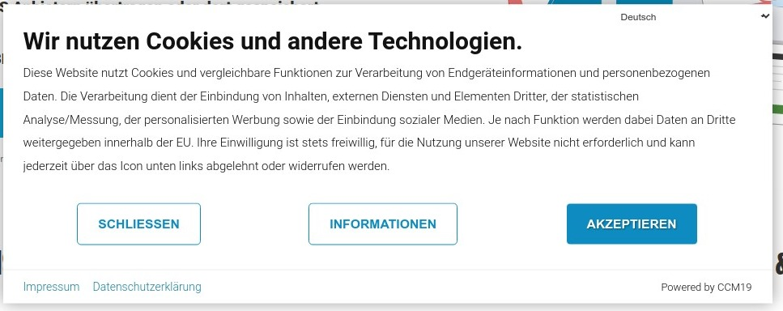
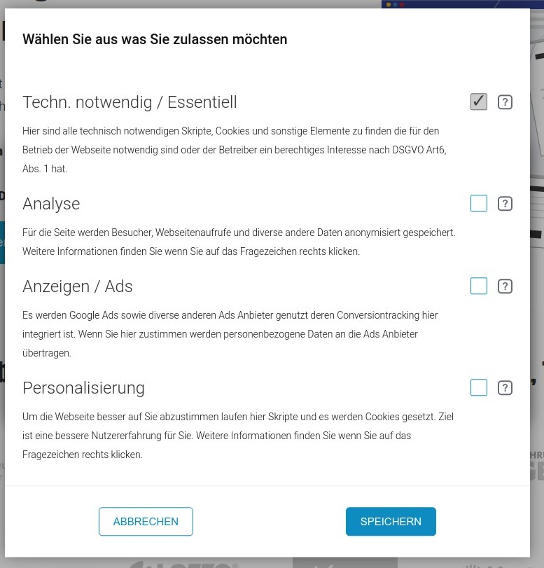
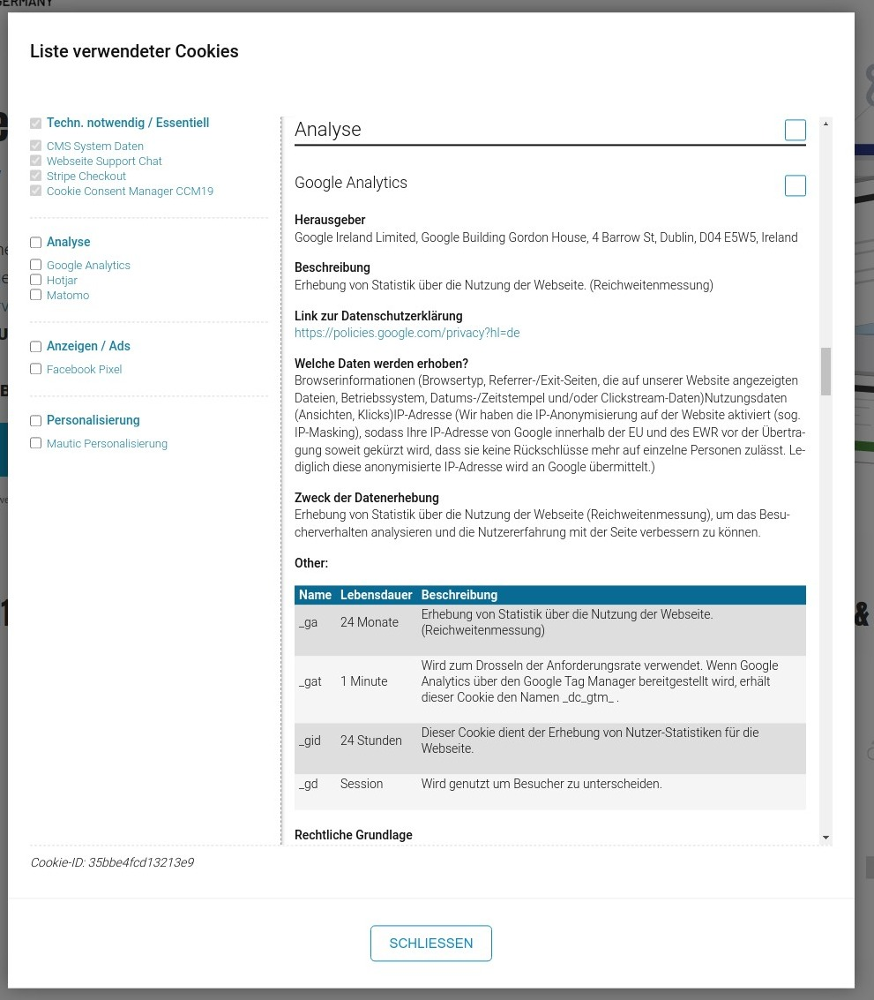

# Frontend widgets

The frontend of CCM19 consists of the widgets you can see and operate and the functions in the source code that the script implements to realize the necessary functions. Below we will go through all the items and show all the windows that CCM19 creates.


## Performance of the widgets

The widget and all other data are minified, compressed and chached on the server side to achieve the best possible performance 

Average loading time of our script is between 0.03 and 0.2 seconds per call.

&gt; If you use a download version, the load time is determined by your server. In general, however, almost all servers ensure that a fast call is possible.


## Primary widget

This is the first widget your website visitors will see. Therefore, it is important that you adapt it to the look and feel of your website. How to do that you can read here: [Themes](../functions/themes.md) - basically all widgets can be completely customized and positioned:

* Center

* Left

* Right

* Top

* Bottom

  



Clicking "Accept" accepts all set scripts and cookies and closes the window immediately. The Consent is stored in the visitor's browser. Clicking on "Close" corresponds to a refusal and via information one gets to the further data in another widget.

### Consent remains

Consent is retained as long as the visitor does not delete the cookie or local storage data in his browser. The maximum duration is set here [Consent storage](../system-and-co/consent-storage.md).  If the page is called again, the mask will **not** be shown 

You can also stop the runtime manually via the administration by lowering the cookie runtime or forcing a reset.


## Settings / Information

If the visitor clicks on the Settings button, he will reach the next screen where he can view, read and confirm the categories of bindings, scripts and cookies.




The category "Technically necessary" or "Technically necessary / Essential" is always checked and cannot be unchecked 

Here are only described the integration and cookies that are indispensable for the functioning of the website. Since the new TTDSG applies, cookies or scripts can no longer be entered here according to §6 DSGVO - justified interest of the operator 

We would rather **not** go into the legal implications at this point. Here you can best ask the lawyer of your confidence.

The visitors can only set these hooks or not. If the visitors click on Save the state as it is displayed will be saved. If one clicks here on "Accept all" all categories with all embeddings in it are accepted.

Cancel takes you back to the previous screen.

### Information about the categories

The individual categories can also get additional texts, you can maintain these in the administration, example see in the following screenshot.


## More information

If visitors want to read more information about each embedding they can click on the question mark and they will be taken to the following screen.




Here the visitors can now read all the elements used on the website in detail, what do the scripts do, what is stored where, who has access to it, etc. You can adjust these settings here:  [Embeddings &amp; Cookies](../functions/cookies-and-others.md) .#

In the left column you can see the embeddings sorted by categories, each entry can be clicked and the visitors will jump directly to the matching entry to get more information. The visitors can agree to each individual embedding or category by category.


## Easy revocation or change - open configuration box

CCM19 offers the visitors an easy way to revoke or change the Consent at any time. As an operator you can simply show the icon below, a click on this icon opens the Consent mask again - so that your visitors can adjust their settings there again.


## Open configuration box again via link

You would like to give your visitors the possibility to change their mind later on and, for example, not to allow analytics cookies after all? Simply insert the following HTML snippet:

``` html
<a href="#" onclick="CCM.openWidget();return false;">Open configuration box
</a>```

Thus, when clicking on this link, the configuration pop-up is opened again for the visitor.

Alternatively, if you cannot insert Javascript links, you can use the following target in a link: **#CCM.openWidget**.

``html
<a href="#CCM.openWidget">Open configuration box
</a>```


## Further possibilities of control in the frontend

More possibilities you can find here - [Javascript / programmatic control](../api/javascript-apis.md) 


## Imprint in frontend

You can embed the imprint either by link or directly - how this works you can read here:  [edit imprint](../functions/imprint.md) . The mask in the frontend looks like this:


## Privacy in the frontend

You can reach the privacy policy if you click on the link "Datenschutzerkläriung", you can edit the data here:  [edit privacy](../functions/privacy.md) 


