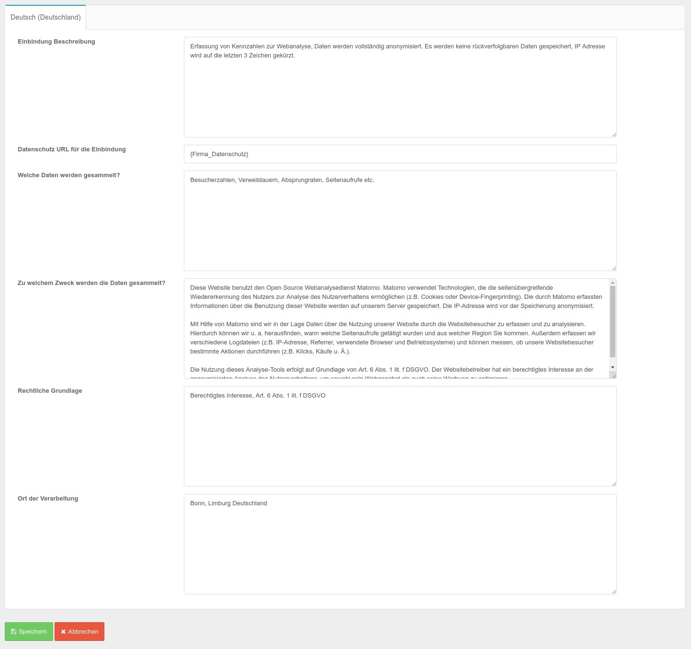

# Cookies & Einbindungen

Mit CCM19 können Sie Ihren Besuchern die Möglichkeit geben, selber zu entscheiden welche Daten über die Besucher erhoben werden.

Damit dies funktioniert müssen alle relevanten Daten im CCM19 zur Verfügung stehen und die Einbindungen müssen getestet werden. Auch wenn CCM19 viel übernehmen kann an automatischen Tests - bleibt es doch immer dem Betreiber überlassen sämtliche Funktionen zu überprüfen.

Eine Übersicht über vorhandene Einbindungen finden Sie unter dem Menüpunkt "Einbindungen & Cookies".

## Übersicht über die vorhandenen Einbindungen


Hier sehen Sie aufgelistet welche Einbindungen auf Ihrer Seite verwendet werden. Sie erkennen auf einen Blick welche Einbindungen aktiv sind, wie sie heißen und von wem diese sind.

Mit dem Klick auf das grüne Symbol kommen Sie in den Editiermodus, der Klick auf den roten Papierkorb löscht nach Nachfrage einen Eintrag.

Der Button "Neuen Eintrag erstellen" führt Sie zur Erstellungsmaske. Sinnvoller ist in der Regel der blaue Button "Eintrag aus Datenbank auswählen". Hier verbindet sich Ihre CCM19 Instanz mit unserer zentralen Datenbank und listet Ihnen die verfügbaren Einträge auf.

## Verfügbare Einbindungen


Hier sehen Sie aufgelistet die Einträge aus unserer Datenbank die Ihnen zur Verfügung stehen. Klicken Sie auf den grünen Button übernehmen um die Daten in die Bearbeitungsmaske zu übernehmen.

Mitunter ist noch eine Anpassung an Ihr Unternehmen oder Webseite notwendig, dies sollten Sie überprüfen damit auch rechtlich alles auf der sicheren Seite ist.

## Bearbeitungsmaske der Einbindungen


In der Bearbeitungsmaske können Sie folgendes eintragen:

### Name der Integration / Einbindung

Der Name der Einbindung - das kann z.B. Matomo sein. Hier sollten Sie einen aussagekräftigen Namen nutzen.

### Zweck

Hier tauchen wieder die schon oben genannten Kategorien auf. Sie können damit jeden Eintrag jeder beliebigen Kategorie zuweisen. Beachten Sie bitte aber dass Sie die rechtlichen Rahmenbedingungen beachten. Facebook Pixel z.B. wird sicher kaum unter technisch notwendig korrekt einsortiert sein. Für eine genaue rechtliche Einordnung sollten Sie auf jeden Fall einen Anwalt konsultieren.

### Aktivieren

Hiermit aktivieren Sie den Eintrag, so dass er auch im Frontend abgehakt werden kann

### Quellcode der Einbindung

Beim Quellcode der Einbindung müssen Sie den Code einfügen, durch den die Einbindung generiert wird. In unserem Beispiel wäre dies der Matomo. \*\*Wenn Sie einen Code einfügen, muss dieser einmalig sein und darf in keinem anderen Cookie eingetragen werden. \*\*

> **Außerdem muss er aus dem direkten Webseitentext entfernt werden, da Sie den Code ansonsten doppelt einbinden würden. Das führt zu technischen Problemen!**

#### Beispiel Matomo

```html
<!-- Matomo / voll anonymisiert, Daten verbleiben auf Firmeneigenen Servern -->
 <script type="text/javascript">
    var _paq = window._paq = window._paq || [];
    /* tracker methods like "setCustomDimension" should be called before "trackPageView" */
    _paq.push(["setDocumentTitle", document.domain + "/" + document.title]);
    _paq.push(["setCookieDomain", "*.www.xy.de"]);
    _paq.push(["setDomains", ["*.www.xy.de"]]);
    _paq.push(['trackPageView']);
    _paq.push(['enableLinkTracking']);
    (function() {
        var u="//analytics.xy.de/";
        _paq.push(['setTrackerUrl', u+'matomo.php']);
        _paq.push(['setSiteId', '1']);
        var d=document, g=d.createElement('script'), s=d.getElementsByTagName('script')[0];
        g.type='text/javascript'; g.async=true; g.src=u+'matomo.js'; s.parentNode.insertBefore(g,s);
    })();
  </script>
<!-- End Matomo Code -->
```

### Anbieter

Der Anbieter - hier muss der Firmenname des Anbieters rein der das Skript anbietet. In unserem Fall wäre es Ihr Unternehmen. Tragen Sie hier auch gerne direkt die komplette Adresse des Unternehmens ein.

### Skripte blockieren

Hier können Sie Skripte die im Quelltext Ihrer Seite eingebunden sind durch CCM19 blockieren. Nutzen Sie z.B. Matomo: Dann tragen Sie in dem Feld z.B. "matomo" ein - damit wird dann auf Ihrer Seite jedes Javascript geblockt dass diese Zeichen (String) enthält und das Skript wird nicht ausgeführt solange kein Consent gegeben wurde.

Auf diese Weise müssen Sie nicht zwingend Ihre Seite umbauen.

> Beachten Sie aber bitte folgendes:
>
> Die Browserhersteller sind immer bemüht alle Inhalte möglichst schnell zu laden, daher kann es vorkommen dass trotz des korrekten Blockierens ein Browser eine Datei trotzdem lädt, der der Ladeprozess schneller angestoßen wurde als er von CCM19 blockiert werden kann. Da geht es um Millisekunden. Diesen Prozess kann kein Cookie Manager der Welt unterbinden da hier in interne Prozesse des Browsers **nicht** eingegriffen werden kann.
>
> Wenn Sie hier auf Nummer sicher gehen wollen müssen Sie die Skripte über die Maske "Quellcode der Einbindung" in die Seite einbauen lassen nach erfolgtem Consent und Ihre Seite umbauen.

### Script-Loader

Nutzen Sie die Funktion „Skripte blockieren, die folgenden Text enthalten“, können Ihre Skripte auf der Website bleiben und CCM19 blockiert diese beim Aufbau der Seite. Allerdings laden alle aktuellen Browser diese Ressourcen trotz korrekter Integration vor dem Eingreifen von CCM19, da diese durch automatisches Preloading durch die Browser geladen werden. Weder CCM19 noch andere Tools können dies verhindern, da der Download der Ressourcen startet, bevor die Ausführung von Skripten durch Browser beginnt.

Um dies nun doch zu verhindern, können Sie Ihren Skripten unseren CCM19-spezifischen Wert für das `type`-Attribut vergeben. Durch diese Anpassung erkennt ein Browser das entsprechende Skript nun nicht mehr als auszuführenden Javascript-Code und lässt von der Verarbeitung dessen zunächst ab.

CCM19 ist in der Lage, Skripte diesen Typs zu verarbeiten und gibt das Skript zum Laden frei, sofern laut Ihrer CCM19-Konfiguration nichts dagegen spricht.

**Unser Typ-Attribut sieht so aus: `type="text/x-ccm-loader"`**

Verwenden Sie diesen Wert für jedes `script`-Tag Ihrer Seite, das entsprechend dieser Funktion geblockt bzw. freigegeben und nachgeladen werden soll. Exemplarisch sieht das Ganze dann so aus:
```html
<script src="https://your.site/script.js" type="text/x-ccm-loader"></script>
```

#### Gruppe für den Script-Loader

Haben Sie Ihre Skripte auf der Website mit unserem Typ-Attribut `type="text/x-ccm-loader"` manuell ausgestattet, können Sie mit dieser Funktion diese Skripte gruppieren und einheitlich blockieren.

Den Gruppennamen definieren Sie pro Einbindung selbst und fügen diesen ebenfalls dem entsprechenden Skript hinzu. Die Gruppenbezeichnung besteht immer aus folgendem Teil: `data-ccm-loader-group="beispiel_bezeichnung"`.

Zusammen mit dem `type`-Attribut sieht es dann so aus:
```html
<script src="https://your.site/script.js" type="text/x-ccm-loader" data-ccm-loader-group="beispiel_bezeichnung"></script>
```

Tragen Sie den Gruppennamen in der relevanten Einbindung unter dem Punkt "Gruppe für den Script-Loader" ein, um die Einbindung mit den markierten Skripten Ihrer Webseite zu verknüpfen.

Sobald ein Seitenbesucher eine solche Einbindung zulässt, werden die gruppierten Skripte nachgeladen.

### Iframes freischalten

> Damit die Freischaltung über die Embeddings funktioniert, müssen Sie den IFrame-Blocker über den Punkt **Iframes > Iframe-Blockierung aktivieren** aktivieren.

Seit Kurzem ist es möglich, Iframes (z.B. von Youtube, Google Maps und Co.) über den Cookie-Banner freizuschalten.

Um Iframes über den Cookiebanner freischalten zu können, tragen Sie in das Feld "Iframes blockieren, die folgenden Text enthalten" Zeichenketten ein, die im IFrame vorkommen.

Für einen Youtube-iFrame wäre die Zeichenkette zum Beispiel "youtube.com"

Für einen Google Maps-iFrame wäre die Zeichenkette zum Beispiel "maps.google.com"

Mit dem Akzeptieren der Kategorie werden automatisch alle entsprechenden IFrames freigeschaltet.

**Bitte beachten Sie weiterhin die rechtlichen Regelungen in Bezug auf IFrames und die korrekte Kategorisierung.**

## Einträge je Sprache



Für jede verwendete Sprache können die folgenden sprachabhängigen Inhalte noch erstellt werden.

### Beschreibung

Bei der Beschreibung tragen Sie die Aufgabe der Einbindung ein. Wieso wird diese gesetzt? Was macht diese Einbindung?

### Datenschutz-Link

Hier gehört der Link zu den Datenschutzbestimmungen des Anbieters hinein. Diesen finden Sie in der Regel wenn Sie auf die Webseite des Anbieters gehen.

### Welche Daten werden gesammelt?

Welche Daten werden ganz genau gesammelt? Nur die IP? Oder auch Klickdaten, Daten des Browsers, Logins, Verhalten uvm? Informieren Sie sich genau bei dem Anbieter des Skriptes und tragen Sie möglichst genau ein was mit den Daten passiert. Nur so ist eine informierte Einwilligung Ihrer Besucher möglich.

### Zu welchem Zweck werden die Daten gesammelt?

Warum sammeln Sie diese Daten? Was wollen Sie damit machen? Conversionoptimierung? Nutzererfahrung verbessern? Oder nur eine Warenkorb Funktion realisieren?

### Rechtliche Grundlage

Hier definieren Sie die rechtliche Grundlage aufgrund dessen Sie diese Einbindung vornehmen wollen. Bei Tracking Skripten greift in der Regel nur "Einwilligung, Art. 6 Abs. 1 lit. a DSGVO" - Einwilligung des Besuchers durch eine informierte Entscheidung. Also rein freiwillig.

### Ort der Verarbeitung

Wo werden die Daten verarbeitet. Hier gilt nicht nur die die Adresse Ihres Büros sondern auch wo steht der Server? Berücksichtigen Sie bitte auch das Sie derzeit keine Daten in unsichere Drittländern übertragen dürfen. Anbieter die Daten in die USA exportieren sind derzeit rechtlich vermutlich nicht möglich (Stand 29.09.2020).

## Liste der Cookies und Storage Elemente


Hier sind alle Cookies und Storage Elemente aufgelistet die das Skript setzt. Sie können von Hand noch weitere Elemente eintragen, da der automatische Scan nicht immer alle Daten finden kann. Z.B. kann der Scanner keine Daten finden für einen eingeloggten Zustand. Auch die von CCM19 handgepflegte Datenbank muss nicht vollständig sein - überprüfen Sie die Daten immer genau.

#### Name

Die Bezeichnung im Browser - z.B. _ga für ein Google Analytics Cookie oder _pk_id.\* für Matomo - das \* ist ein Platzhalter.

#### dyn.

Hiermit bestimmen Sie ob es eine dynamische Variable ist - z.b. werden mit _pk_id.\* alle Cokies geblockt die mit _pk_id. anfangen, also _pk_id.123 usw.

#### Speichertyp

Wie werden die Daten in Ihrem Browser gespeichert.

#### Livetime / Expires

Wann läuft der Speichereintrag automatisch aus.

#### Wert

Welchen Wert transportiert das Cookie - in der Regel sind es kryptische Daten die hier gespeichert werden.


## Google Consent Mode (beta)


Beta deswegen weil er bei Google noch Beta Status hat - nicht bei CCM19. Google Consent Mode ist eine neue Funktionalität für Webseiten, die den Google Tag Manager verwenden, um Google-Dienste wie Google Ads, Floodlight oder Google Analytics einzubinden.

Falls Sie den Google Tag Manager verwenden, wählen Sie bitte aus, welche Zustimmungs-Arten für Google mit dieser Einbindung impliziert werden sollen.

Weitere Informationen zum Google Consent Mode (beta) von Google finden Sie hier: [https://support.google.com/analytics/answer/9976101?hl=de](https://support.google.com/analytics/answer/9976101?hl=de)

## Urls ausschließen


Auf diesen Seiten die Einbindung NICHT ausspielen, das bedeutet dass die aktuell ausgewählte Einbindung im Tag Manager Modus die Einbindung nicht aktiviert resp. im Blockmodus diese nicht freigibt. 

Dies kann unter verschiedenen Umständen Sinn machen. 

Tragen Sie eine URL pro Zeile ein. Am Ende können Sie ein * als Platzhalter verwenden. Ohne Platzhalter wird die URL exakt verglichen! Tragen Sie also bitte nur vollständige und gültige URLs ein.

Beispiel: https://www.ccm19.de/data.html* wirkt sich aus auf

- https://www.ccm19.de/data.html
- https://www.ccm19.de/data.htmlx
- https://www.ccm19.de/data.html?var1=test

… und so weiter.

## Speichern

Mit Klick auf den Button Speichern werden die Daten in die CCM19 Administration Ihrer Seite übernommen und stehen dann direkt für das Frontend Widget zur Verfügung.Cookies der eigenen Seite manuell bestimmen