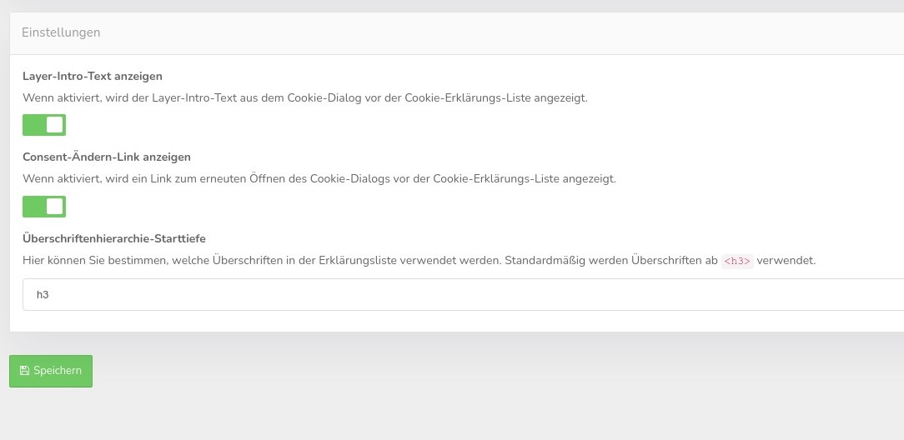

# Cookie explanation table

With this function you can define the embedding of a cookie explanation table in the content. You can embed this table anywhere on your page, it is recommended of course the page of the privacy settings and there the cookie section.

## Embedding.

Use the following code in your privacy policy or similar page in the place where you want the list of all configured embeds and cookies to appear. The placeholder will be populated with the cookie declaration list once CCM19 is loaded. The display language is automatically determined by the visitor's browser.

``html
<div class="ccm-cookie-declaration">Please enable javascript to see the list of all declared cookies and similar techniques.
</div>```

Use the following code if you want to display the table in a fixed language. (Replace *en_DE* with any language code configured and enabled under Texts &amp; Languages):

``html
<div class="ccm-cookie-declaration" data-lang="de_DE">Please enable Javascript to see the list of all declared cookies and similar techniques.
</div>```

The list uses the styling of the enclosing website. Customization is possible by changing the CSS stylesheets of your website or via Custom CSS in the Theme menu item.

## Cookie table settings

Here you can set whether the default texts are output and whether you want to display the Consent change link at the table. In the select field you choose the headings hierarchy with which the data is displayed so that it fits well into your DS.

