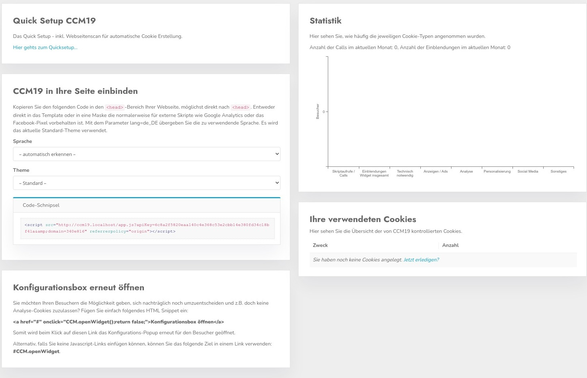

# Dashboard

Das Domaindashboar. Hier landen Sie direkt nachdem Sie eine Domain ausgewählt haben im Domain Manager. In diesem Dashboard sind einige Grundfunktionen aufgeführt.





## Quicksetup

Wenn Sie den Link klicken landen Sie direkt wieder im Onboarding zu dieser Domain, dieses können Sie beliebig oft durchlaufen, allerdings werden alte Daten dabei immer wieder überschrieben.

## CCM19 in Ihre Seite einbinden

Der wichtigeste Punkt an diesers Stelle - hier finden Sie das HTML Schnipsel dass Sie brauchen um die Verbindung zwischen Ihrer Seite und CCM19 herzustellen.

Kopieren Sie den Eintrag der dort gelistet ist - wie hier z.B. zu sehen.

.jpg)

Sie sollten natürlich den Eintrag aus der Oberfläche nutzen und nicht den hier aus der Dokumentation :-)

In der Maske können Sie auswählen in welcher Sprache die Maske dargestellt werden soll, generell ist es auch möglich dass die Maske die Sprache des Besuchers aus dem Browser ausliest **und** es gibt die Möglichkeit die Sprache im Frontend Widget auszuwählen.


## Konfigurationsbox erneut öffnen per Link

Sie möchten Ihren Besuchern die Möglichkeit geben, sich nachträglich noch umzuentscheiden und z.B. doch keine Analyse-Cookies zuzulassen? Fügen Sie einfach folgendes HTML Snippet ein:

``` html
<a href="#" onclick="CCM.openWidget();return false;">Konfigurationsbox öffnen</a>
```

Somit wird beim Klick auf diesen Link das Konfigurations Pop-Up erneut für den Besucher geöffnet.

Alternativ, falls Sie keine Javascript-Links einfügen können, können Sie das folgende Ziel in einem Link verwenden: **#CCM.openWidget**.

```html
<a href="#CCM.openWidget">Konfigurationsbox öffnen</a>
```

## Statistik

In der kleinen Statistik bekommt man eine Übersicht über die Nutzung des CCM19 Widgets auf der ausgewählten Domain. Es wird angezeigt wie oft das Widget eingeblendet wurde, wie oft das Skript abgerufen wurde und einiges mehr.

## Verwendete Cookie

Die kurze Liste der Cookies und Einbindungen gibt Ihnen eine kleine Übersicht über die verwendetet Daten auf Ihrer Seite.
