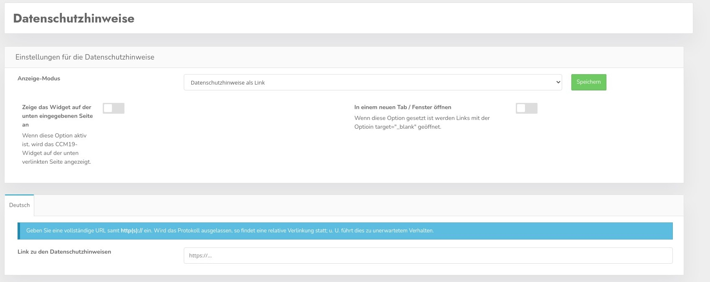

# Privacy policy

According to the GDPR, the privacy policy of a page - as well as the imprint - must be readable by the user before a consent. The visitor may not be forced to make a consent before he has seen this data.

## Privacy policy as link - standard

You have the possibility to set the link to the privacy policy directly, for this you have to set the setting in the following mask as follows: "Privacy policy as link".

Then you can enter the link to the privacy policy directly and it will be used that way in the frontend.

### Show the widget on the page below

If you check this box the widget will also be displayed on the privacy notice page. However, this is not useful in most cases, because according to the GDPR, access to the privacy notice page must also be possible without a banner.

Therefore, the checkmark is not set by default **and** you should think carefully if you really want to use it that way if you want to activate the checkmark.

### Open in a new tab

If the check mark is set, the links will open in a new window with target="_blank"

## Edit privacy policy

You can create and edit the privacy policy directly in the administration, on the following screenshot you can see the edit screen.

## Privacy policy in frontend

To comply with the GDPR, CCM19 includes the possibility to either make the privacy policy directly accessible in the widget, as shown in the screenshot, or to link it.

The link then opens a screen where the privacy policy of the page is output - as seen here.

## Direct display of the privacy policy

