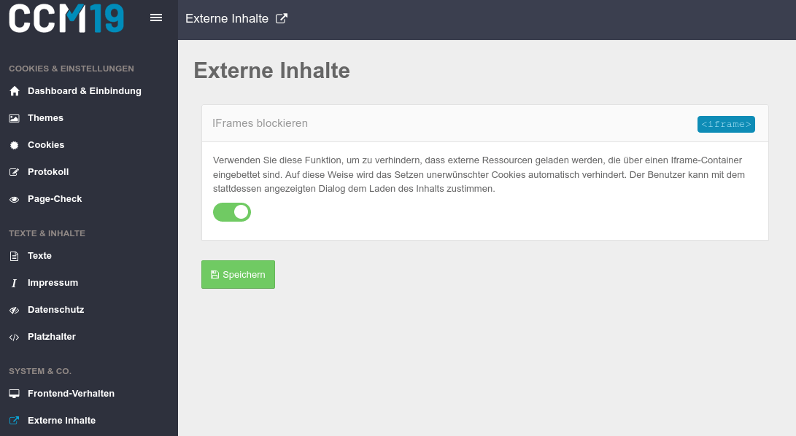
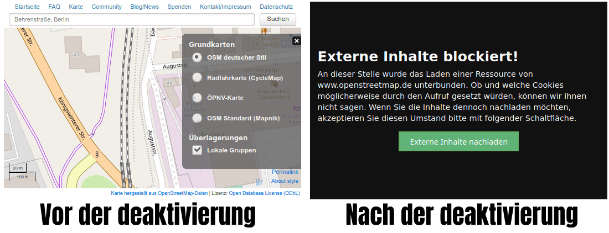

# Externe Inhalte

Über den Punkt Externe Inhalte können Sie eingebundene IFrames auf Ihrer Seite blockieren. Da technisch gesehen auch die eingebundene Seite [Cookies](https://www.ccm19.de/glossar/13-Cookies.html#13) setzen und auslesen kann sollten IFrames unterbunden werden.

Statt des IFrame-Inhalts wird dann der vorher definierte Text angezeigt und der Besucher muss den Inhalt des IFrames manuell nachladen.

Mit der Deaktivierung des IFrames sind Sie auf der sicheren Seite, auch wenn die Einblendungen sicher nie so attraktiv sind wie die Elemente die sie verbergen.