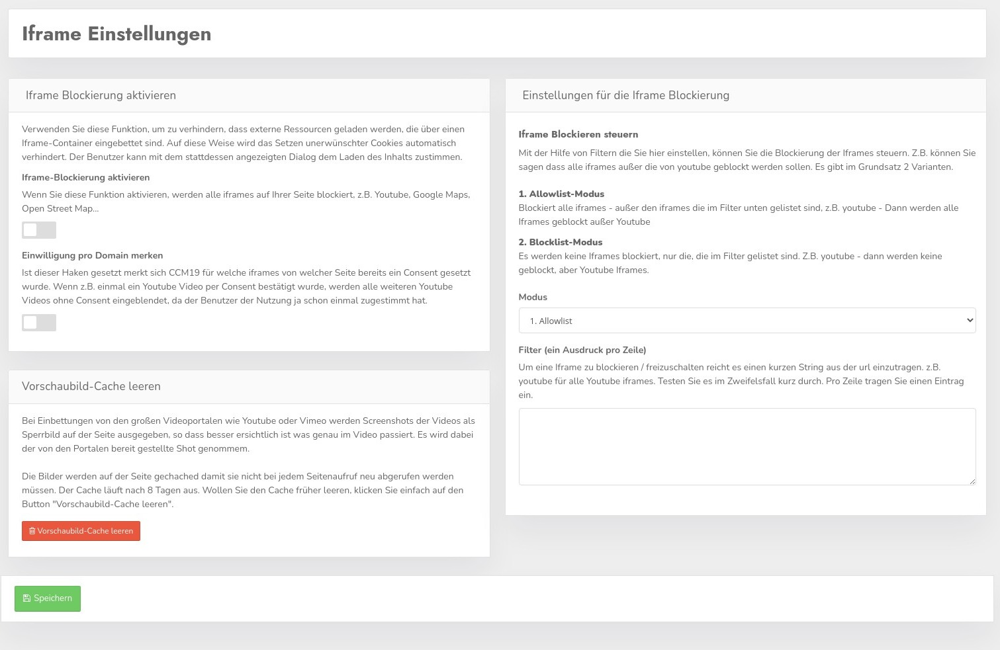

# Block iframes

Use this function to prevent loading external resources embedded via an iframe container. This automatically prevents unwanted cookies from being set. The user can agree to load the content with the dialog that appears instead.

## Enable iframe blocking

With the check mark you enable the blocking of IFrames - probably obviously...

## Remember consent per domain

If this hook is set CCM19 remembers for which iframes from which page a Consent was already set. If e.g. a Youtube video was confirmed once by Consent, all further Youtube videos without Consent are faded in, since the user agreed to the use already once 

&gt; Whether this is compliant with the GDPR can not be said at this time, we currently assess it positively, but of course the decision remains with you.

### Iframe exceptions

There are different variants here, if you do not set anything here, everything will always be blocked by default.

### Whitelist mode

If you select this option, all iframes that are not in the filter list will be blocked. If you enter e.g. youtube, only the iframe from youtube will not be blocked, but all others. (However, we do not recommend this procedure for Youtube) 

### Blacklist mode

In this variant no iframes are blocked, unless they are in the list here. If you now enter youtube there, only the iframes of youtube will be blocked, but not all others.

## Filter

Write one expression per line 

### Thumbnails

When embedding from the big video portals like Youtube or Vimeo, screenshots of the videos are displayed as a blocking image on the page, so that it is easier to see what exactly is happening in the video. The shot provided by the portals is taken.

The images are cached on the page so that they do not have to be retrieved every time the page is called up. The cache expires after 8 days. If you want to clear the cache earlier, just click the "Clear thumbnail cache" button.
