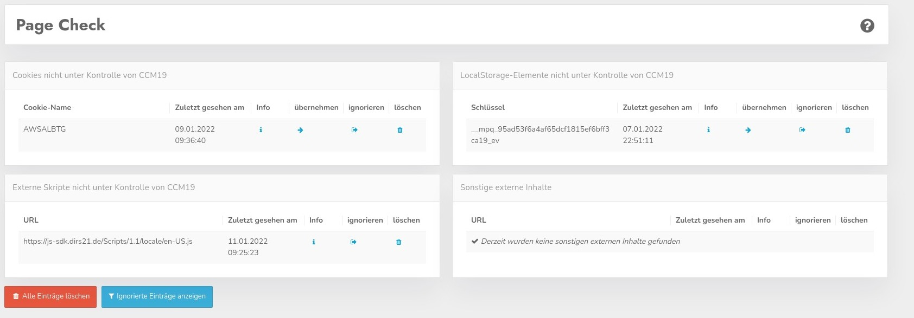

# Page Check

The Page Check helps you to find or control external scripts, cookies and other external content. The tables show you if cookies exist that you don't control or if scripts are running outside of CCM19's control.

It is important to find this data, because in the course of time scripts are integrated in parts of the site from time to time and are forgotten after some time. Who documents something like that.

However, the scanner also finds so-called user scripts and cookies that are brought in from other sites. Browsers sometimes do not behave consistently here. The cause cannot be explained from our side, the browser manufacturers would have to take a closer look.

In the background, a scanner always runs externally in these cases to check whether the corresponding cookie or other element is also contained on the subpage where it is listed in the CCM19, if not, it is automatically set to "Ignore" and not displayed here 

Therefore, take a close look if you really find data here that is running on your site. If yes, enter the data into your local database. A manual check from time to time is certainly recommended.

### Script information

In the scripts you will find a blue **i** in the info column - if you click on it you will see where the script was found. The list is limited to a few entries. If this happens more often, you should investigate more specifically what is happening. Maybe the page has been hacked.

### New cookie found

.jpg)

If CCM19 finds a new cookie - as you can see on the screenshot, you can add the cookie to your list by clicking on the arrow next to the cookie name. If the cookie is known in our database, even the matching entries will be pre-populated directly into your mask as you already know from the transfer from the database.
