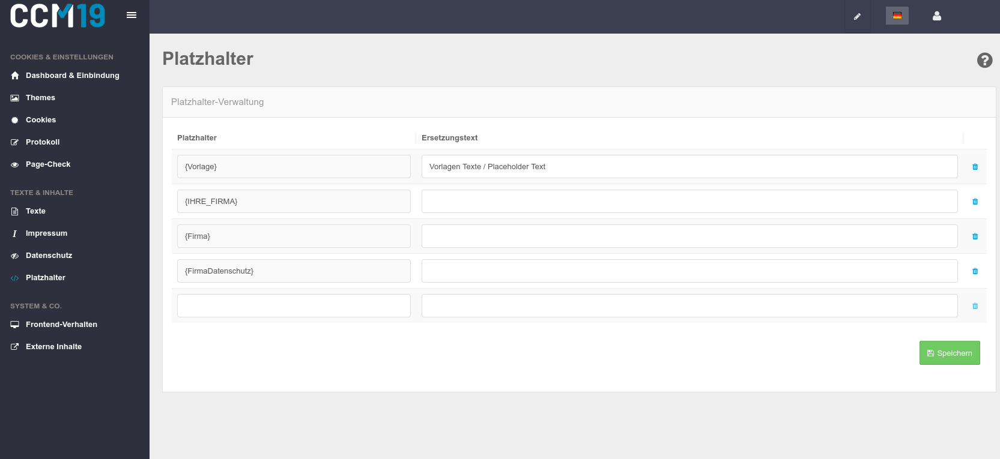

# Platzhalter

Über die Platzhalter können Sie immer wiederkehrende Texte automatisch einfügen lassen. Zum Beispiel lohnt es sich hier den Firmen-Namen oder die eigene Datenschutz-Seite anzulegen, um diese einfach in die einzelnen [Cookies](https://www.ccm19.de/glossar/13-Cookies.html#13) einzufügen und ggf. ändern zu könnnen, wenn die URL sich ändert.

Schreiben Sie dazu in die Spalte **Platzhalter** die Phrase, die ersetzt werden soll. DIe Platzhalter müssen hier zwingend in geschweifte Klammern gesetzt werden {}.

In der Spalte **Ersetzungstext** tragen Sie den entsprechenden Wert ein, durch den der Platzhalter ersetzt werden soll.

###  Beispiel

| Platzhalter         | Ersetzungstext                                  |
| :------------------ | :---------------------------------------------- |
| {Firma_Datenschutz} | https://www.ccm19.de/datenschutzerklaerung.html |
| {Firma}             | CCM19                                           |
| {Firma_Impressum}   | https://www.ccm19.de/impressum.html             |