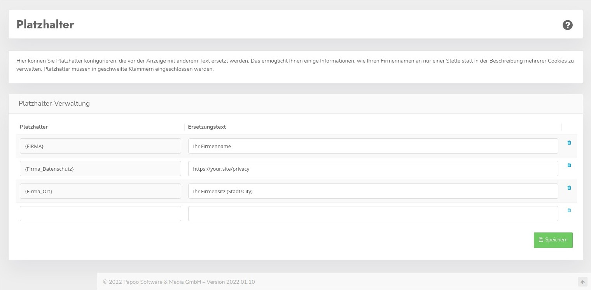

# Placeholder

You can use the placeholders to automatically insert recurring texts. For example, it is worthwhile to create the company name or your own data protection page here, so that you can easily insert these into the individual cookies and change them if necessary when the URL changes.

To do this, write the phrase that is to be replaced in the **Placeholder** column. The placeholders must be enclosed in curly brackets {}.

In the **Replacement text** column, enter the corresponding value with which the placeholder is to be replaced.

### Example

| Placeholder | Replacement text examples |
| :------------------ | :---------------------------------------------- |
| {company_data_protection} | https://www.ccm19.de/datenschutzerklaerung.html |
| {COMPANY}             | CCM19 |
| {Company_Imprint} | https://www.ccm19.de/impressum.html |
| {Company_Location} | Bonn |